# Documentazione Tecnica Book Recommender

## Indice dei Contenuti
- [Panoramica Architetturale](#panoramica-architetturale)
- [Stack Tecnologico](#stack-tecnologico)
- [Struttura Modulare](#struttura-modulare)
- [Architettura di Sistema](#architettura-di-sistema)
- [Schema Database](#schema-database)
- [Documentazione API](#documentazione-api)
- [Ottimizzazione Performance](#ottimizzazione-performance)
- [Implementazione Sicurezza](#implementazione-sicurezza)
- [Strategia di Testing](#strategia-di-testing)
- [Analisi codice](#analisi-codice)
- [Guida al Deployment](#guida-al-deployment)


## Panoramica Architetturale

Book Recommender è un'**applicazione multi-modulo Maven** progettata per raccomandazioni di libri universitari utilizzando **Java 17** e **JavaFX 17.0.12**. Il sistema segue un'**architettura client-server distribuita** con RMI (Remote Method Invocation) per la comunicazione inter-processo.

### Principi di Design Chiave
- **Architettura a tre livelli**: Layer Client, Server e Database
- **Pattern Model-View-Controller (MVC)** per componenti UI
- **Pattern Data Access Object (DAO)** per operazioni database
- **Layer Service** per astrazione logica di business
- **Dependency Injection** per accoppiamento debole
- **Strategia di Caching** a molteplici livelli (client e server)
- **Pattern Circuit Breaker** per tolleranza ai guasti

## Design Pattern utilizzati nell'Applicazione

### 1. Singleton

**Scopo:** Garantire che una classe abbia una sola istanza e fornire un punto di accesso globale.

#### Esempi nel codice

```java
// SessionManager.java
public class SessionManager {
    private static volatile SessionManager instance;
    
    public static SessionManager getInstance() {
        if (instance == null) {
            synchronized (SessionManager.class) {
                if (instance == null) {
                    instance = new SessionManager();
                }
            }
        }
        return instance;
    }
}
```

```java
// ServiceLocator.java
public class ServiceLocator {
    private static UserService userService;
    private static BookService bookService;
    private static LibraryService libraryService;
    
    public static UserService getUserService() {
        return userService;
    }
    
    public static void initAll(UserService u, BookService b, LibraryService l, ...) {
        userService = u;
        bookService = b;
        libraryService = l;
        // ...
    }
}
```

**Dove viene usato:**
- `SessionManager` - Gestione sessione utente
- `ServiceLocator` - Accesso ai servizi RMI
- `Navigator` - Navigazione tra scene
- `BookStatisticsManager` - Statistiche libri


### 2. Strategy

**Scopo:** Definire una famiglia di algoritmi, incapsularli e renderli intercambiabili.

#### Esempio nel codice

```java
// ControllerDesign.java - Enum come Strategy
private enum SearchFilter {
    TUTTI,
    TITOLO,
    AUTORE,
    AUTORE_ANNO
}

private SearchFilter currentSearchFilter = SearchFilter.TUTTI;

private void cercaLibro(String query) {
    List<Book> allResults = switch (currentSearchFilter) {
        case TUTTI -> localSearch(query);
        case TITOLO -> localSearchByTitle(term, year);
        case AUTORE -> localSearchByAuthor(term, -1);
        case AUTORE_ANNO -> localSearchByAuthorAndYear(term, year);
    };
}
```

**Vantaggio:** Facile aggiungere nuovi filtri di ricerca senza modificare la logica principale.


### 3. Observer / Listener

**Scopo:** Definire una dipendenza uno-a-molti tra oggetti, così quando un oggetto cambia stato, tutti i suoi dipendenti vengono notificati.

#### Esempi nel codice

```java
// LanguageChangeListener.java
public interface LanguageChangeListener {
    void onLanguageChanged(String newLanguage);
}

// LanguageManager.java
private static final List<LanguageChangeListener> listeners = new CopyOnArrayList<>();

public static void addListener(LanguageChangeListener listener) {
    listeners.add(listener);
}

private static void notifyLanguageChange(String newLanguage) {
    for (LanguageChangeListener listener : listeners) {
        try {
            listener.onLanguageChanged(newLanguage);
        } catch (Exception e) {
            logger.log(Level.WARNING, "Error notifying language change listener", e);
        }
    }
}
```

```java
// ProfileImageListener.java
public interface ProfileImageListener {
    void onProfileImageChanged(File imageFile);
}

// JavaFX Observable patterns
searchingBooks.textProperty().addListener((obs, oldVal, newVal) -> {
    // Reagisce al cambiamento del testo
});
```

**Dove viene usato:**
- Cambio lingua dell'applicazione
- Cambiamento immagine profilo
- Aggiornamenti UI JavaFX (textProperty, selectedProperty)


### 4. DAO (Data Access Object)

**Scopo:** Separare la logica di accesso ai dati dalla logica di business.

#### Esempio nel codice

```java
// Interfaccia DAO
public interface UserDAO {
    boolean registerUser(User utente);
    User findByUsernameOrEmail(String usernameOrEmail);
    User findByID(String ID);
    boolean updateProfileInfo(User user);
    boolean updatePassword(String username, String newPassword);
}

// Implementazione
public class UserDAOImpl implements UserDAO {
    private final Connection connection;
    
    public UserDAOImpl(DataSource ds) {
        this.connection = ds.getConnection();
    }
    
    @Override
    public boolean registerUser(User u) {
        String sql = "INSERT INTO users ...";
        try (PreparedStatement stmt = connection.prepareStatement(sql)) {
            stmt.setString(1, u.getID());
            stmt.setString(2, u.getName());
            // ...
            return stmt.executeUpdate() > 0;
        } catch (SQLException e) {
            throw new DatabaseException("Failed to register user", e);
        }
    }
}
```

**Gerarchia DAO:**
```
UserDAO (interface)
    └── UserDAOImpl

BookDAO (interface)
    └── BookDAOImpl

LibraryDAO (interface)
    └── LibraryDAOImpl

ReviewDAO (interface)
    └── ReviewDAOImpl

SuggestionDAO (interface)
    └── SuggestionDAOImpl
```


### 5. Service Layer

**Scopo:** Incapsulare la logica di business in un livello separato.

#### Architettura a tre livelli

```
Controller (Client) ──RMI──> ServiceImpl (Server)
                              │
                              ▼
                        ServiceCore
                              │
                              ▼
                           DAOImpl
```

### Esempio

```java
// Interfaccia shared (accessibile da client e server)
public interface UserService extends Remote {
    boolean registerUser(User utente) throws RemoteException;
    User login(String username, String password) throws RemoteException;
    boolean invalidateSession(String token) throws RemoteException;
}

// Implementazione RMI (wrapper)
public class UserServiceImpl extends UnicastRemoteObject implements UserService {
    private UserServiceCore core;
    
    public UserServiceImpl(UserDAO dao) throws RemoteException {
        this.core = new UserServiceCoreImpl(dao);
    }
    
    @Override
    public boolean registerUser(User u) throws RemoteException {
        try {
            return core.registerUser(u);
        } catch (Exception e) {
            throw new ServiceException("Errore registrazione", e);
        }
    }
}

// Core service (logica di business)
public class UserServiceCoreImpl implements UserServiceCore {
    private final UserDAO userDAO;
    
    public UserServiceCoreImpl(UserDAO userDAO) {
        this.userDAO = userDAO;
    }
    
    @Override
    public boolean registerUser(User u) throws Exception {
        // Logica di business: validazioni, hashing password, etc.
        String hashedPassword = PasswordHashUtil.hash(u.getPassword());
        u.setPassword(hashedPassword);
        return userDAO.registerUser(u);
    }
}
```

### 6. Service Locator

**Scopo:** Fornire un punto centrale per ottenere riferimenti ai servizi.

#### Esempio

```java
// ServiceLocator.java
public class ServiceLocator {
    private static UserService userService;
    private static BookService bookService;
    private static LibraryService libraryService;
    private static ReviewsService reviewsService;
    private static SuggestionsService suggestionsService;
    
    public static void initAll(UserService u, BookService b, LibraryService l, 
                               ReviewsService r, SuggestionsService s) {
        userService = u;
        bookService = b;
        libraryService = l;
        reviewsService = r;
        suggestionsService = s;
    }
    
    public static UserService getUserService() {
        return userService;
    }
    
    public static BookService getBookService() {
        return bookService;
    }
    // ...
}

// Utilizzo nel client
ServiceLocator.getUserService().login(username, password);
ServiceLocator.getBookService().findByAuthor("King");
```

**Vantaggi:**
- Accesso centralizzato ai servizi
- Facile sostituzione per testing (mock)
- Nasconde la complessità della lookup RMI

---

## 7. RMI Proxy / Remote Pattern

**Scopo:** Permettere la comunicazione tra client e server su rete.

### Struttura

```
Client                              Server
   │                                   │
   │── RMI Registry lookup ───────────►│
   │                                   │
   │◄── Stub (proxy) ─────────────────│
   │                                   │
   │── Chiamata metodo ───────────────►│
   │                                   │
   │◄── Risultato ─────────────────────│
```

### Esempio

```java
// Interfaccia Remote (shared)
public interface BookService extends Remote {
    List<Book> findByAuthor(String author) throws RemoteException;
    Book getBookDetails(int book_id) throws RemoteException;
    List<Book> getSuggestedBooks(int bookId) throws RemoteException;
}

// Implementazione Server
public class BookServiceImpl extends UnicastRemoteObject implements BookService {
    private BookServiceCore core;
    
    public BookServiceImpl(BookDAO dao) throws RemoteException {
        this.core = new BookServiceCoreImpl(dao);
    }
    
    @Override
    public List<Book> findByAuthor(String author) throws RemoteException {
        try {
            return core.findByAuthor(author);
        } catch (Exception e) {
            throw new ServiceException("Errore ricerca", e);
        }
    }
}

// Client riceve lo stub dal registry e lo usa
BookService bookService = (BookService) registry.lookup("BookService");
List<Book> books = bookService.findByAuthor("King");  // Chiamata remota trasparente
```


## Stack Tecnologico

### Backend
| Tecnologia | Versione | Scopo |
|---|---|---|
| Java | 17 | Linguaggio principale |
| PostgreSQL | 42.7.2 | Database di produzione |
| H2 | 2.2.224 | Database di testing |
| HikariCP | 5.1.0 | Connection pooling |
| RMI | Built-in | Comunicazione remota |

### Frontend
| Tecnologia | Versione | Scopo |
|---|---|---|
| JavaFX | 17.0.12 | Framework GUI |
| FXML | - | UI dichiarativa |
| Ikonli | 12.3.1 | Libreria icone |
| FontAwesome5 | 8.9 | Pacchetto icone |

### Librerie
| Tecnologia | Versione | Scopo |
|---|---|---|
| Lombok | 1.18.32 | Generazione codice |
| BCrypt | 0.10.2 | Hashing password |
| JWT | 0.12.5 | Autenticazione token |
| OpenCSV | 5.7.1 | Parsing CSV |
| SLF4J | 2.0.9 | Facciata logging |
| Logback | 1.4.14 | Implementazione logging |
| Micrometer | 1.12.0 | Raccolta metriche |
| Resilience4j | 2.2.0 | Circuit breaker |
| JUnit | 4.13.2 | Testing unità |
| Mockito | 5.11.0 | Framework mocking |


## Struttura Modulare

### Modulo Condiviso (`src/shared/`)
Contiene modelli comuni, utility e interfacce RMI condivise tra client e server.

**Struttura Pacchetti:**
```
it.uninsubria.shared/
├── model/              # Modelli di dominio
│   ├── Book.java
│   ├── User.java
│   ├── Library.java
│   ├── Review.java
│   └── Recommendation.java
├── exception/          # Classi di eccezioni
│   ├── AuthenticationException.java
│   ├── BusinessLogicException.java
│   ├── DatabaseException.java
│   ├── NetworkException.java
│   └── SecurityException.java
│   └── ValidationException.java
├── rmi/                # Interfacce remote
│   ├── UserService.java
│   ├── BookService.java
│   ├── LibraryService.java
│   ├── ReviewsService.java
│   └── SuggestionService.java
|
└── utils/              # Utility condivise
    ├── AppConfig.java
    ├── AppConstants.java
    └── LoggerUtil.java
```

### Modulo Server (`src/serverBR/`)
Gestisce logica di business, operazioni database e implementazione server RMI.

**Struttura Pacchetti:**
```
it.uninsubria.server/
├── bootstrap/           # Inizializzazione applicazione
├── cache/             # Strategie di caching
│   ├── CacheManager.java
│   ├── DistributedCacheManager.java
│   ├── CacheWarmUpService.java
│   └── HybridCacheManager.java
├── dao/               # Data Access Objects
│   ├── UserDAO.java
│   ├── BookDAO.java
│   ├── LibraryDAO.java
│   ├── SuggestionDAO.java
│   ├── ReviewDAO.java
│   └── impl/
│       ├── UserDAOImpl.java
│       ├── BookDAOImpl.java
│       ├── LibraryDAOImpl.java
│       ├── SuggestionDAOImpl.java
│       └── ReviewDAOImpl.java
|
├── db/                # Gestione database
│   ├── DBInitializer.java
│   ├── ServerController.java
│   ├── DataSeeder.java
│   └── BookRecommenderServer.java
|
├── di/                # Dependency Injection
│   └── ServerDIContainer.java
|
├── exception/         # Eccezioni personalizzate
│   ├── DatabaseException.java
│   ├── AuthenticationException.java
│   |── ValidationException.java
│   ├── BusinessLogicException.java
│   ├── NetworkException.java
│   └── SecurityException.java
|
├── monitoring/        # Monitoraggio sistema
│   ├── MonitoringService.java
│   └── CircuitBreakerService.java
|
├── rmi/              # Implementazioni servizi RMI
│   └── impl/
│       ├── UserServiceImpl.java
│       |── BookServiceImpl.java
│       ├── LibraryServiceImpl.java
│       |── ReviewServiceImpl.java
│       └── SuggestionServiceImpl.java
│       
├── service/          # Layer logica di business
│   ├── LibraryServiceCore.java
│   ├── LibraryServiceCoreImpl.java
│   |── BookServiceCore.java
│   ├── BookServiceCoreImpl.java
│   ├── ReviewsServiceCore.java
│   |── ReviewsServiceCoreImpl.java
│   |── SuggestionServiceCore.java
│   ├── SuggestionServiceCoreImpl.java
│   |── PasswordService.java
│   ├── UserServiceCore.java
│   └── UserServiceCoreImpl.java
│   
└── util/             # Utility server
    ├── InputValidator.java
    ├── ConnectionPoolManager.java
    |── CodiceFiscaleValidator.java
    ├── JWTUtil.java
    ├── PasswordHashUtil.java
    └── SessionManager.java
```

### Modulo Client (`src/clientBR/`)
Applicazione client basata su JavaFX con UI ricca e caching.

**Struttura Pacchetti:**
```
it.uninsubria.client/
├── cache/             # Caching lato client
│   └── ClientCacheManager.java
|
├── controller/        # Controller UI
│   ├── ControllerBase.java
│   ├── login/
│   │   ├── ControllerLogin.java
│   │   └── ControllerFormForgotPassword.java
│   ├── registration/
│   │   └── ControllerRegistration.java
|   |
│   └── homepage/
│       ├── home/
│       │   ├── ControllerDesign.java
│       │   └── viewHome.java
│       ├── libreria/
│       │   ├── LibraryListController.java
│       │   └── ValutazioneController.java
│       ├── categories/
│       │   ├── CategoriesController.java
│       │   └── CategoryDetailController.java
│       ├── help/
│       │   ├── FAQController.java
│       │   └── ContactFormController.java
│       └── settings/
│           ├── viewSettings.java
│           └── contentsettings/
│               ├── contentModifyProfile.java
│               └── contentChangePasswordSettings.java
|
├── di/               # Dependency Injection client
│   └── DIContainer.java
|
├── rmi/              # Client RMI
│   ├── RMIClient.java
│   └── ClientServiceManager.java
|
├── utils/
│   ├── classesUI/     # Utility UI
│   │   ├── LanguageManager.java
│   │   ├── ThemeManager.java
│   │   ├── Navigator.java
│   │   ├── SessionManager.java
│   │   ├── NotificationManager.java
│   │   ├── BookServiceManager.java
│   │   └── ThreadPoolManager.java
│   └── classesLogic/ # Utility business
│       ├── ClassGetImages.java
│       └── VideoUtils.java
|
└── BookRecommenderApp.java # Punto di ingresso applicazione principale
```

### Modulo Launcher (`src/launcher/`)
Launcher GUI per gestione processi e avvio server.


## Architettura di Sistema

### Architettura a Tre Livelli

```
┌─────────────────────────────────────────────────────────────┐
│                     Layer Client (JavaFX)                   │
│  ┌──────────────┐  ┌──────────────┐  ┌──────────────┐       │
│  │ Controllers  │  │    Cache     │  │   Utilities  │       │
│  └──────────────┘  └──────────────┘  └──────────────┘       │
│           │                                                 │
│           ▼                                                 │
│  ┌──────────────────────────────────────────────────┐       │
│  │         RMI Client (ClientServiceManager)        │       │
│  └──────────────────────────────────────────────────┘       │
└─────────────────────────────────────────────────────────────┘
                           │
                           ▼
┌─────────────────────────────────────────────────────────────┐
│                    Layer Network (RMI)                      │
│  ┌──────────────────────────────────────────────────┐       │
│  │    Remote Method Invocation (Porta 1099)         │       │
│  └──────────────────────────────────────────────────┘       │
└─────────────────────────────────────────────────────────────┘
                           │
                           ▼
┌─────────────────────────────────────────────────────────────┐
│                     Layer Server                            │
│  ┌──────────────┐  ┌──────────────┐  ┌──────────────┐       │
│  │   Services   │  │   Cache Mgr  │  │  Monitoring  │       │
│  └──────────────┘  └──────────────┘  └──────────────┘       │
│           │                                                 │
│           ▼                                                 │
│  ┌──────────────────────────────────────────────────┐       │
│  │           Layer DAO (Data Access Objects)        │       │
│  └──────────────────────────────────────────────────┘       │
└─────────────────────────────────────────────────────────────┘
                           │
                           ▼
┌─────────────────────────────────────────────────────────────┐
│                  Layer Database (PostgreSQL)                │
│  ┌──────────────────────────────────────────────────┐       │
│  │               Connection Pool (HikariCP)         │       |
│  └──────────────────────────────────────────────────┘       │
└─────────────────────────────────────────────────────────────┘
```

### Flusso delle Richieste

1. **Azione Utente** → Controller gestisce evento UI
2. **Controller** → Chiama Service Manager (se disponibile in cache)
3. **Service Manager** → Client RMI invia richiesta
4. **Server RMI** → Riceve e instrada a Service Core
5. **Service Core** → Validazione logica di business
6. **DAO** → Operazioni database via HikariCP
7. **Risposta** → Traccia indietro attraverso i layer
8. **Aggiornamento Cache** → Cache client/server aggiornata
9. **Aggiornamento UI** → Thread JavaFX aggiorna interfaccia


## Schema ER

### 1. Full digramma ER
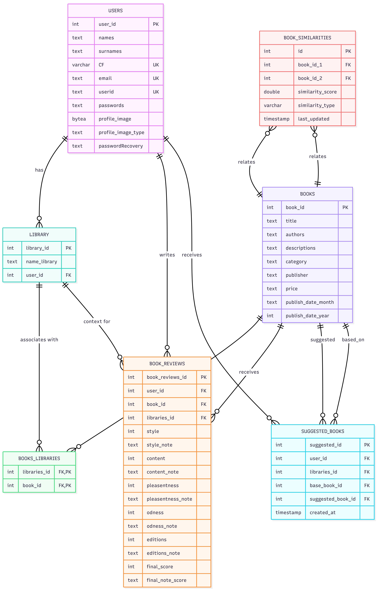


### 2. Dettagli entità relazioni
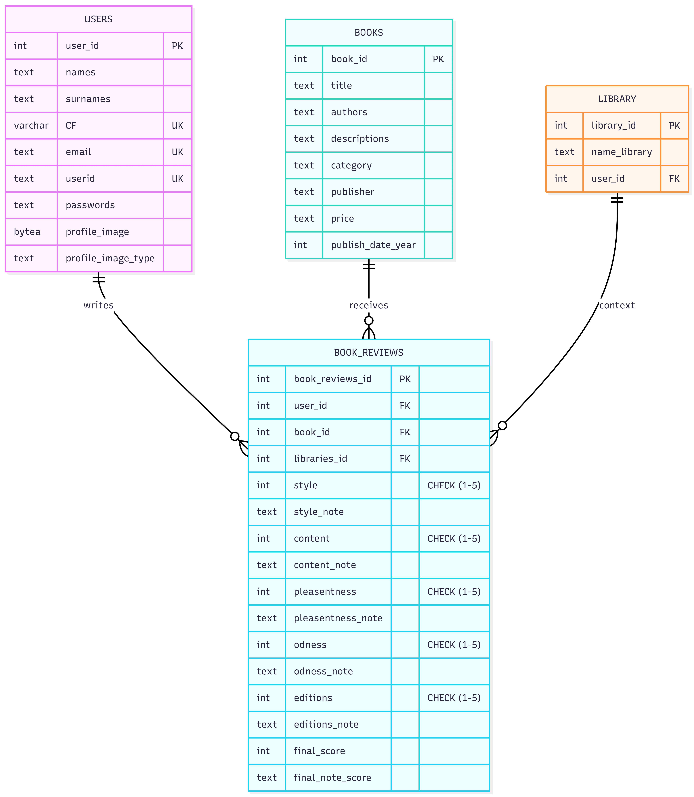


### 4. Relazione Libreria-Libro 
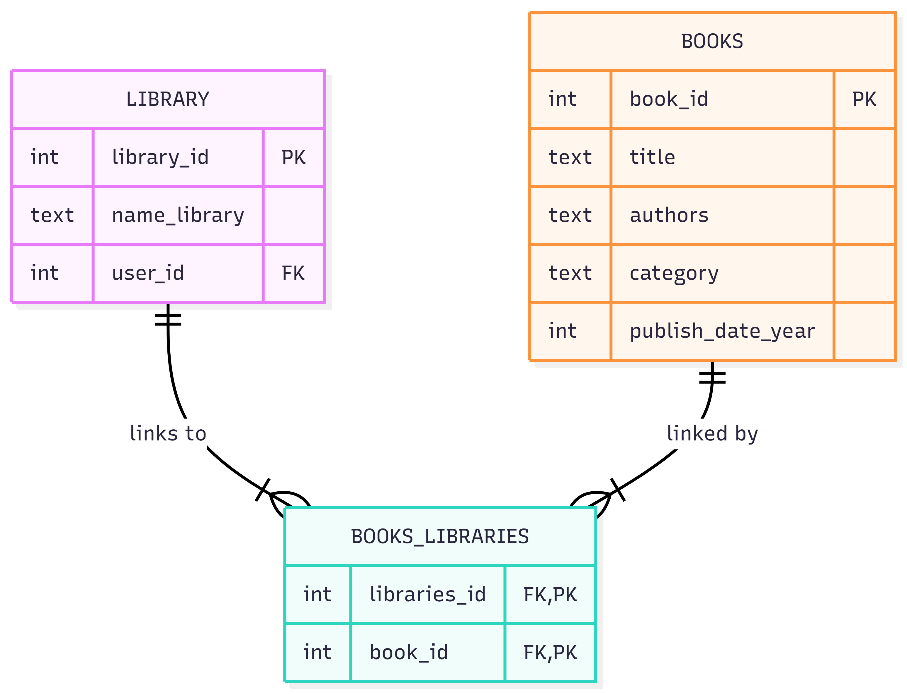


### 5. Schema sistema di suggerimenti
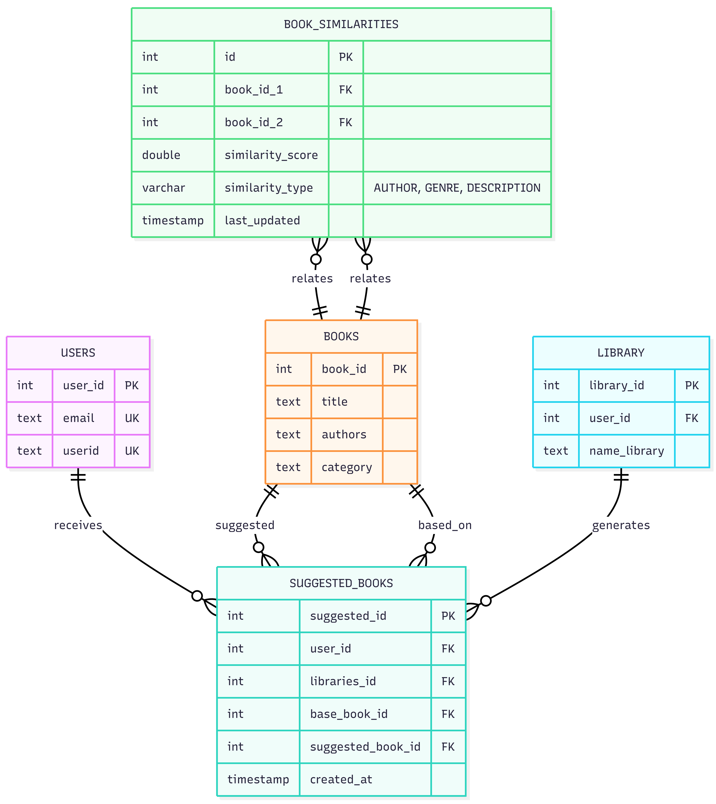


### 7. Costanti e indici

#### Relazioni chiavi esterne

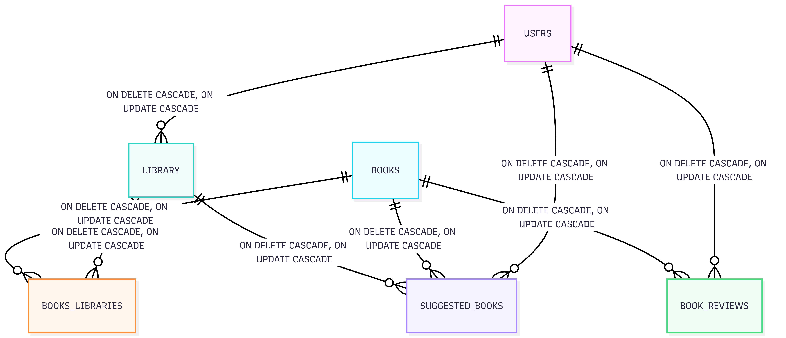


#### Vincoli di unicità


### Come sono stati creati i diagrammi? 
Per la realizzazione degli schemi è stato utilizzato **Mermaid**, software online che permette di caricare un codice con una determinata sintassi e viene tramutato in diagramma

#### Generatori di diagrammi online
1. [Mermaid Live Editor](https://mermaid.live/) 
2. [Mermaid Chart](https://www.mermaidchart.com/) 
3. [Draw.io](https://app.diagrams.net/) 
4. [PlantText](https://www.planttext.com/) 


### Statistiche database 

#### Crescita aspettata

| Tabella | Record iniziali | 1 Anno | 2 Anno |
|----|----|----|----|
| Users | 100 | 1,000 | 5,000 |
| Books | 10,000 | 15,000 | 20,000 |
| Library | 500 | 5,000 | 25,000 |
| Book Reviews | 1,000 | 10,000 | 50,000 |
| Suggested Books | 5,000 | 50,000 | 250,000 |
| User Interactions | 10,000 | 100,000 | 500,000 |

#### Spazio occupato

- **Users**: ~2 KB per utente → 10 MB (5,000 utenti)
- **Books**: ~1 KB per libro → 20 MB (20,000 libri)
- **Reviews**: ~0.5 KB per recensione → 25 MB (50,000 recensione)
- **Suggestions**: ~0.3 KB per suggerimento → 75 MB (250,000 suggerimento)

**Stima totale**: ~130 MB in circa 2 anni


### Troubleshooting

#### Problemi comuni

##### **Violazione del vincolo di unicità**

**Problema**: Duplicato in una entry unique
**Soluzione**: Controlla se già esiste il record

##### **Errore chiave esterna**

**Problema**: Non si può aggiungere un record, la chiave riferenziata non esiste
**Soluzione**: Assicurati che il padre esista prima di creare record figli


## Schema UML

### 1. Architettura di sistema

#### Diagramma ad alto livello

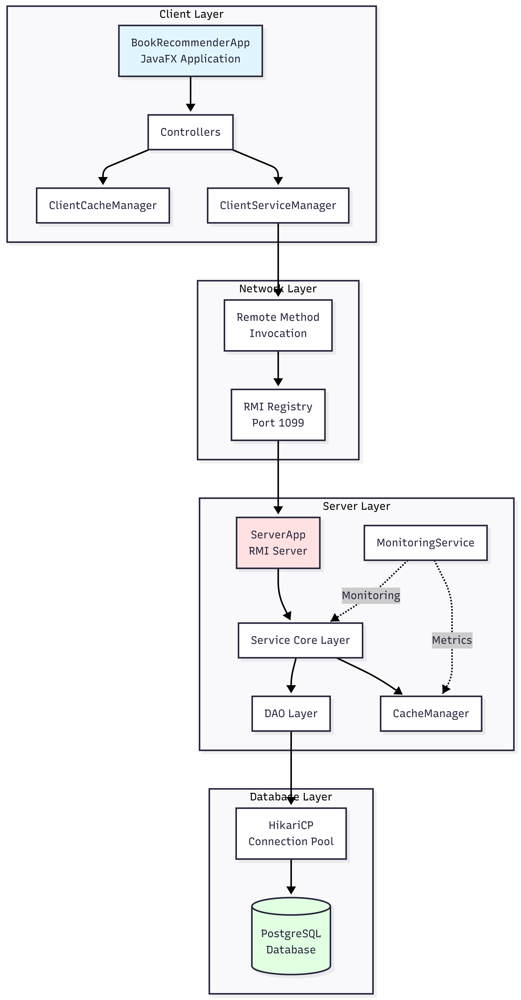


### 2. Class Diagram

#### Modelli di Dominio

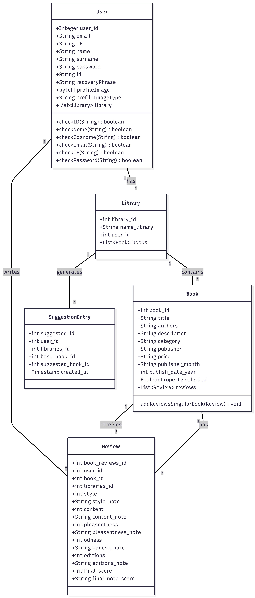


### 3. Class Diagram - Architettura server

#### Componenti lato server

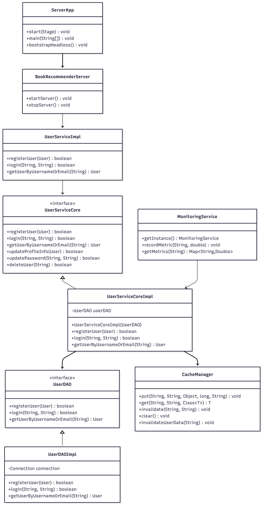


### 4. Class Diagram - Architettura client

#### Componenti lato client

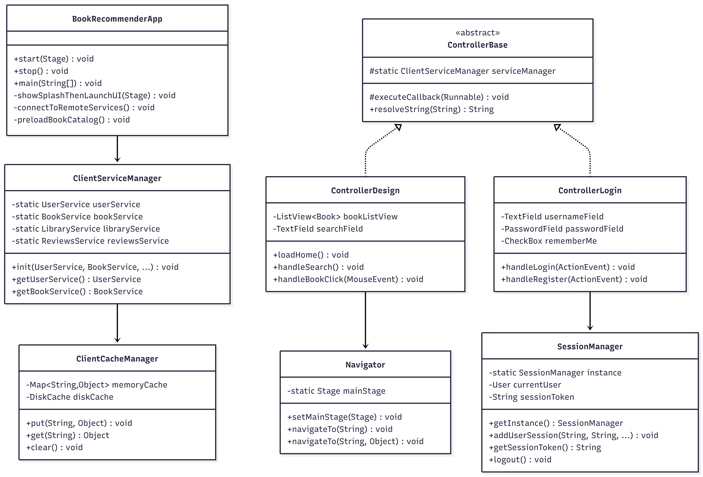


### 5. Sequence Diagram - Processo di login

#### Autenticazione utente

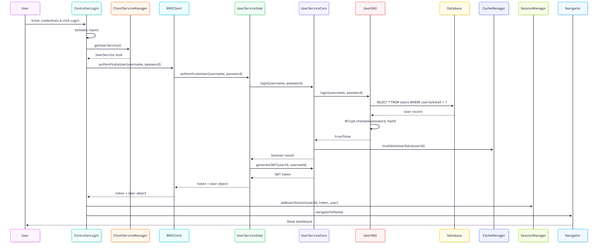


### 6. Sequence Diagram - Ricerca libri

#### Cerca e Mostra libri

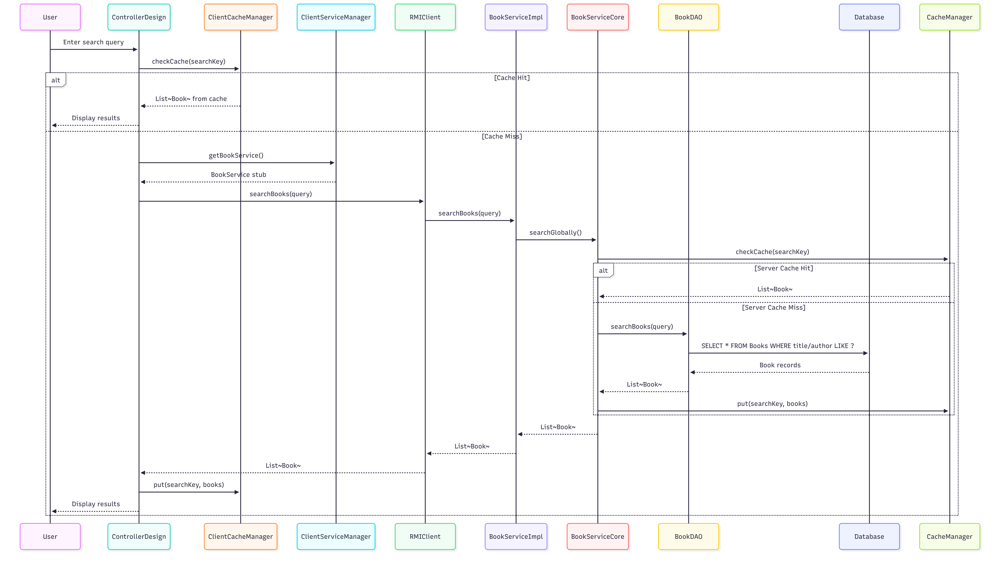


### 7. Activity Diagram - Registration Flow

#### User Registration Process


### 8. State Diagram - Session Management

#### User Session States

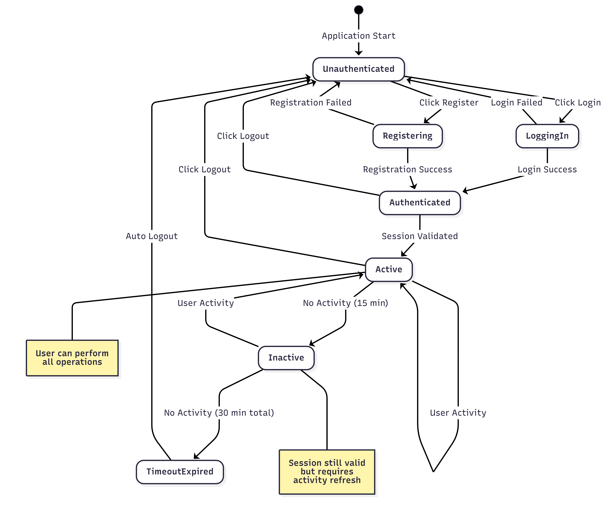


## Documentazione API

### Gestione eccezioni

#### Esempio 1: RetryUtils - Gestione di RemoteException con Retry Automatico

**File:** `src/clientBR/src/main/java/it/uninsubria/client/utils/classesUI/RetryUtils.java`

### Pattern Implementato

```java
/**
 * Esegue un'operazione RMI con retry automatico in caso di fallimento
 *
 * @param operation    l'operazione da eseguire
 * @param operationName nome dell'operazione per logging
 * @param <T>          tipo di ritorno dell'operazione
 * @return             il risultato dell'operazione
 * @throws Exception   se tutti i tentativi falliscono
 */
public static <T> T executeWithRetry(Callable<T> operation, String operationName) throws Exception {
    Exception lastException = null;

    for (int attempt = 1; attempt <= MAX_RETRIES; attempt++) {
        try {
            return operation.call();  // Tentativo esecuzione
        } catch (RemoteException e) {
            lastException = e;
            if (attempt < MAX_RETRIES) {
                // Log dettagliato con tentativo corrente
                logger.log(Level.WARNING,
                    "Tentativo {0}/{1} fallito per ''{2}'': {3}. Nuovo tentativo in {4}ms...",
                    new Object[]{attempt, MAX_RETRIES, operationName, e.getMessage(), RETRY_DELAY_MS});

                Thread.sleep(RETRY_DELAY_MS);  // Attesa tra tentativi
            }
        } catch (Exception e) {
            // Altre eccezioni NON vengono ritentate
            logger.log(Level.SEVERE, "Errore non recuperabile in ''{0}'': {1}",
                new Object[]{operationName, e.getMessage()});
            throw e;
        }
    }

    // Tutti i tentativi falliti: wrapping in RuntimeException
    throw new RuntimeException("Operazione fallita dopo " + MAX_RETRIES + " tentativi: " + operationName, lastException);
}
```

### Utilizzo

```java
// Esempio di chiamata con retry
List<Book> books = RetryUtils.executeWithRetry(() -> {
    return ServiceLocator.getBookService().findByAuthor("King");
}, "ricerca libri autore King");
```

### Caratteristiche del Pattern

| Aspetto | Implementazione |
|---------|----------------|
| **Retry selettivo** | Solo `RemoteException` viene ritentata |
| **Configurabile** | Tentativi e delay da `ClientAppConfig` |
| **Logging dettagliato** | Livello WARNING con contesto (tentativo, operazione, messaggio) |
| **Interrupt handling** | Gestione corretta di `InterruptedException` |
| **Eccezione finale** | Wrapping con causa originale preservata |
| **Non-retry per altre eccezioni** | Subito propagate senza ritento |

### Gerarchia Eccezioni Coinvolte

```
Exception
├── RemoteException          ← Ritentata automaticamente
│   └── ConnectException     ← Sottoclasse comune per problemi di rete
├── SQLException             ← Non ritentata
├── IllegalArgumentException ← Non ritentata
└── RuntimeException         ← Non ritentata
```

---

### Best Practice per la Gestione delle Eccezioni

#### 1. Eccezioni Personalizzate

L'applicazione utilizza una gerarchia di eccezioni personalizzate:

```java
// Server
public class DatabaseException extends RuntimeException { }
public class ValidationException extends RuntimeException { }
public class ServiceException extends RuntimeException { }

// Client
public class ClientException extends RuntimeException { }
```

#### 2. Logging Corretto

```java
// ❌ Errato: loggare e poi rilanciare senza contesto
catch (Exception e) {
    logger.severe(e.getMessage());
    throw e;
}

// ✓ Corretto: loggare con contesto e includere stack trace
catch (Exception e) {
    logger.log(Level.SEVERE, "Errore durante operazione X per utente Y", e);
    throw new ServiceException("Operazione X fallita", e);
}
```

#### 3.Finally per Pulizia

```java
try {
    // Operazione che potrebbe fallire
    connection.setAutoCommit(false);
    performOperation();
    connection.commit();
} catch (SQLException e) {
    if (connection != null) {
        try {
            connection.rollback();
        } catch (SQLException ex) {
            logger.log(Level.WARNING, "Rollback fallito", ex);
        }
    }
    throw new DatabaseException("Operazione fallita", e);
} finally {
    // Pulizia risorse
    if (connection != null) {
        try {
            connection.close();
        } catch (SQLException e) {
            logger.log(Level.WARNING, "Chiusura connessione fallita", e);
        }
    }
}
```

#### In generale:

1. **Eccezioni di sistema** (RemoteException, SQLException): possono essere ritentate o gestite con fallback
2. **Eccezioni di business** (ValidationException, AuthenticationException): sempre rilanciate senza retry
3. **Eccezioni unchecked** (RuntimeException): usare per errori irreversibili
4. **Wrapping**: includere sempre l'eccezione originale come causa (`new Exception("msg", e)`)
5. **Logging**: loggare prima di rilanciare, con contesto sufficiente per debug


### Servizi RMI Remoti

#### **UserService**
```java
public interface UserService extends Remote {
    boolean registerUser(User user) throws RemoteException, Exception;
    String authenticateUser(String username, String password) throws RemoteException, Exception;
    User getUserByUsernameOrEmail(String identifier) throws RemoteException, Exception;
    boolean updateProfileInfo(User user) throws RemoteException, Exception;
    boolean updatePassword(String userID, String newPassword) throws RemoteException, Exception;
    boolean validateSession(String token) throws RemoteException, Exception;
    void invalidateSession(String token) throws RemoteException, Exception;
}
```

#### **BookService**
```java
public interface BookService extends Remote {
    List<Book> searchGlobally() throws RemoteException, Exception;
    Book getBookById(int bookId) throws RemoteException, Exception;
    List<Book> getBooksByCategory(String category) throws RemoteException, Exception;
    List<Book> searchBooks(String query) throws RemoteException, Exception;
}
```

#### **LibraryService**
```java
public interface LibraryService extends Remote {
    Library createLibrary(Library library) throws RemoteException, Exception;
    List<Library> getUserLibraries(int userId) throws RemoteException, Exception;
    boolean addBookToLibrary(int libraryId, int bookId) throws RemoteException, Exception;
    boolean removeBookFromLibrary(int libraryId, int bookId) throws RemoteException, Exception;
    List<Book> getLibraryBooks(int libraryId) throws RemoteException, Exception;
}
```

#### **ReviewsService**
```java
public interface ReviewsService extends Remote {
    Review addReview(Review review) throws RemoteException, Exception;
    List<Review> getBookReviews(int bookId) throws RemoteException, Exception;
    Review getUserBookReview(int userId, int bookId) throws RemoteException, Exception;
}
```

#### **SuggestionsService**
```java
public interface SuggestionsService extends Remote {
    List<SuggestionEntry> getSuggestions(int userId, int libraryId) throws RemoteException, Exception;
    List<Recommendation> getRecommendations(int userId) throws RemoteException, Exception;
}
```


## Ottimizzazione Performance

### Strategia di Caching

#### **Caching Lato Server**
- **Hybrid Cache Manager**: Combina caching in-memory e distribuito
- **Cache Warming**: Precarica libri popolari all'avvio
- **Configurazione TTL**: 5 minuti per utenti, 30 minuti per libri
- **Invalidazione Cache**: Automatica su modifiche dati

```java
CacheManager.put(userId, key, result, DEFAULT_TTL_MS, category);
```

#### **Caching Lato Client**
- **Cache Immagini**: Cache basato su disco per copertine libri
- **Cache Catalogo Libri**: In-memory con persistenza disco
- **Cache Sessioni**: Token JWT e sessioni utente
- **Cache Risorse**: Risorse UI e template

### Connection Pooling

**Configurazione HikariCP:**
- **Dimensione Massima Pool**: 10 connessioni
- **Minimo Idle**: 2 connessioni
- **Timeout Connessione**: 30 secondi
- **Timeout Idle**: 10 minuti
- **Durata Massima**: 30 minuti

### Operazioni Asincrone

**Configurazione ThreadPoolManager:**
- **Pool Thread Critici**: 4 thread per task ad alta priorità
- **Pool Thread Background**: 8 thread per task generali
- **Pool Caricamento Immagini**: 6 thread per processamento immagini

```java
ThreadPoolManager.executeCritical(() -> {
    loadingTask.run();
});
```

### Ottimizzazione Database

- **Utilizzo Indici**: Chiavi esterne e colonne frequentemente interrogate
- **Ottimizzazione Query**: Prepared statements, operazioni batch
- **Riutilizzo Connessioni**: Pooling HikariCP
- **Lazy Loading**: Collezioni caricate on-demand


## Implementazione Sicurezza

### Autenticazione & Autorizzazione

#### **Sicurezza Password**
```java
// Hashing BCrypt con 12 round
String hashedPassword = BCrypt.hashpw(plainPassword, BCrypt.gensalt(12));

// Verifica
boolean isValid = BCrypt.checkpw(plainPassword, hashedPassword);
```

#### **Gestione Token JWT**
```java
// Generazione token
String token = JWTUtil.generateToken(userId, username, 30 * 60 * 1000); // 30 min

// Validazione token
Claims claims = JWTUtil.validateToken(token);

// Invalidazione token
userService.invalidateSession(token);
```

### Validazione Input

#### **Validazione Lato Server**
```java
public static boolean checkEmail(String email) {
    if (email == null || email.isEmpty() || email.length() > 320) return false;
    String emailRegex = "^[a-zA-Z0-9._%+-]+@[a-zA-Z0-9.-]+\\.[a-zA-Z]{2,}$";
    return email.matches(emailRegex);
}
```

#### **Requisiti Password**
- Minimo 8 caratteri
- Almeno una lettera maiuscola
- Almeno una lettera minuscola
- Almeno una cifra
- Almeno un carattere speciale: `!@#$%^&*()_-+=<>?[]{}|;:,.`
- Nessun carattere non valido

#### **Validazione Codice Fiscale**
- Esattamente 16 caratteri
- Solo alfanumerici maiuscoli
- Seguono il pattern: **XXXXXXNNXNNXNNNX** di cui X = lettere e N = numeri

### Gestione Sessioni

#### **Gestione Timeout**
- **Timeout Default**: 15 minuti di inattività
- **Timeout Remember Me**: 30 minuti
- **Auto-logout**: Scadenza sessione automatica

```java
TimeoutManager.getInstance().resetTimer();
TimeoutManager.getInstance().setTimeoutMinutes(15);
```

#### **Persistenza Sessioni**
- Storage criptato su disco
- Gestione token sicura
- Pulizia automatica al logout

### Crittografia

#### **Crittografia Dati**
```java
// Crittografia AES-256 per dati sensibili
String encrypted = EncryptionService.encrypt(data, key);
String decrypted = EncryptionService.decrypt(encrypted, key);
```

#### **Immagini Profilo**
- Memorizzate come BLOB nel database
- Validazione tipo MIME
- Limiti dimensione applicati


## Strategia di Testing

### Testing Unitario

**Framework:** JUnit 4.13.2 + Mockito 5.11.0

**Struttura Test:**
```
src/*/test/java/it/uninsubria/
├── server/
│   ├── service/
│   │   ├── UserServiceCoreTest.java
│   │   └── BookServiceCoreTest.java
│   ├── cache/
│   │   └── CacheManagerTest.java
│   └── dao/
│       ├── TestUserDAO.java
│       └── TestBookDAO.java
├── client/
│   ├── utils/
│   │   ├── SessionManagerTest.java
│   │   └── LanguageManagerTest.java
│   └── cache/
│       └── ClientCacheManagerTest.java
└── shared/
    └── model/
        └── UserTest.java
```

**Database Test:** H2 in-memory per testing isolato

### Testing di Integrazione

**Scenari:**
- Comunicazione server-client RMI
- Transazioni database
- Consistenza cache
- Workflow end-to-end

**Smoke Test:**
```java
@Test
public void testUserCoreDelegation() throws Exception {
    TestUserDAO dao = new TestUserDAO();
    UserServiceCore core = new UserServiceCoreImpl(dao);
    User u = User.builder().id("alice").name("Alice").build();
    assertTrue(core.registerUser(u));
}
```

### Testing Performance

**Load Testing:**
- Simulazione utenti concorrenti
- Stress pool connessioni database
- Metriche performance cache

**Monitoraggio:**
```java
Metriche Micrometer:
- Latenza richieste
- Tassi hit cache
- Tempi query database
- Connessioni attive
```


## Analisi codice

### Analisi Metodi Fondamentali del Sistema BookRecommender

1. **Metodo Fondamentale del Client: start() in BookRecommenderApp.java**

### Codice del Metodo:
```java
@Override
public void start(Stage primaryStage) {
    // Aggiungi shutdown hook per cleanup in caso di chiusura forzata
    addShutdownHook();

    // Aggiungi listener per intercettare chiusura finestra
    addWindowCloseListener(primaryStage);

    showSplashThenLaunchUI(primaryStage);
}
```

### Spiegazione:
Il metodo `start()` rappresenta il punto di ingresso dell'applicazione JavaFX client. È responsabile dell'inizializzazione completa dell'interfaccia utente e della gestione del ciclo di vita dell'applicazione. Il metodo configura:

- **Shutdown hooks**: Per garantire il cleanup delle risorse anche in caso di chiusura forzata
- **Window close listeners**: Per gestire correttamente la chiusura della finestra principale
- **Splash screen e UI principale**: Coordina la sequenza di avvio con splash screen e caricamento progressivo

### Complessità Algoritmica:
- **Tempo**: O(1) - operazioni sequenziali costanti
- **Spazio**: O(1) - nessun uso significativo di memoria aggiuntiva
- **Perché fondamentale**: È il metodo principale che orchestra tutto il flusso di avvio dell'applicazione client, gestendo sia il caricamento iniziale che la terminazione pulita.


## 2. Metodo Fondamentale del Server: bootstrapHeadless() in ServerApp.java

### Codice del Metodo:
```java
private static void bootstrapHeadless() {
    try {
        it.uninsubria.server.monitoring.MonitoringService.getInstance();
        logger.info("Monitoring service initialized");

        // Load database configuration from environment variables for security
        String host = System.getenv("DB_HOST");
        if (host == null || host.trim().isEmpty()) {
            host = "localhost"; // fallback for development
        }

        String dbName = System.getenv("DB_NAME");
        if (dbName == null || dbName.trim().isEmpty()) {
            dbName = "projectb"; // fallback for development
        }

        String user = System.getenv("DB_USER");
        if (user == null || user.trim().isEmpty()) {
            throw new RuntimeException("DB_USER environment variable is required");
        }

        String password = System.getenv("DB_PASSWORD");
        if (password == null || password.trim().isEmpty()) {
            throw new RuntimeException("DB_PASSWORD environment variable is required");
        }

        it.uninsubria.server.db.DBInitializer.initialize(host, dbName, user, password);
        BookRecommenderServer.startServer();

        // Initialize cache warm-up after server is ready
        try {
            it.uninsubria.server.cache.CacheWarmUpService.warmUpCache(
                it.uninsubria.server.di.ServerDIContainer.getBookCore()
            );
        } catch (Exception e) {
            logger.warning("Cache warm-up failed to initialize: " + e.getMessage());
        }

        logger.info("Headless server started with enhanced monitoring and caching. RMI registry on port 1099.");

        Runtime.getRuntime().addShutdownHook(new Thread(() -> {
            logger.info("Shutting down services...");
            it.uninsubria.server.cache.HybridCacheManager.shutdown();
            it.uninsubria.server.cache.CacheWarmUpService.shutdown();
            try {
                BookRecommenderServer.stopServer();
            } catch (Exception e) {
                logger.severe("Error stopping server: " + e.getMessage());
            }
            logger.info("Services shutdown completed");
        }));

        // Keep the server running
        while (true) {
            Thread.sleep(1000);
        }
    } catch (Exception e) {
        logger.severe("Server startup failed: " + e.getMessage());
        System.exit(1);
    }
}
```

### Spiegazione:
Il metodo `bootstrapHeadless()` è il cuore dell'avvio del server in modalità headless (senza interfaccia grafica). Coordina l'inizializzazione completa del server RMI, inclusi:

- **Monitoring service**: Per il monitoraggio delle prestazioni
- **Configurazione database**: Caricamento sicuro delle credenziali da variabili d'ambiente
- **Inizializzazione DB**: Setup del database PostgreSQL/H2
- **Avvio server RMI**: Registrazione dei servizi remoti
- **Cache warm-up**: Precaricamento dei dati più utilizzati
- **Shutdown hooks**: Gestione pulita della terminazione

### Complessità Algoritmica:
- **Tempo**: O(1) - operazioni di inizializzazione sequenziali, anche se alcune (come cache warm-up) potrebbero essere O(n) dove n è il numero di libri
- **Spazio**: O(1) - risorse allocate sono indipendenti dall'input
- **Perché fondamentale**: È il metodo che rende operativo l'intero backend del sistema, coordinando database, cache, e servizi RMI.


## 3. Metodo Fondamentale del Launcher: onRunServer() in LauncherApp.java

### Codice del Metodo:
```java
private void onRunServer() {
    if (currentEnvStatus == null || !currentEnvStatus.allPrerequisitesMet) {
        showAlert(LauncherLanguageManager.getString("launcher.alert.prerequisites.title"),
                   LauncherLanguageManager.getString("launcher.alert.prerequisites.message"));
        return;
    }

    if (serverRunning) {
        showAlert(LauncherLanguageManager.getString("launcher.alert.server.running.title"),
                   LauncherLanguageManager.getString("launcher.alert.server.running.message"));
        return;
    }

    appendToStatus(LauncherLanguageManager.getString("launcher.status.server.starting"));
    serverRunning = true;
    serverConnected = false; // Server not yet connected
    updateButtonsState(currentEnvStatus != null && currentEnvStatus.allPrerequisitesMet);

    // Show progress indicator
    Platform.runLater(() -> {
        serverProgressIndicator.setVisible(true);
        serverProgressIndicator.setProgress(-1); // Indeterminate progress
    });

    // Run server startup in background senza aspettare che finisca
    CompletableFuture.runAsync(this::startServerProcessAsync)
        .thenRun(() -> {
            javafx.application.Platform.runLater(() -> {
                serverProgressIndicator.setVisible(false);
                serverProgressIndicator.setProgress(0); // Reset progress
                serverConnected = true; // Server is now connected to DB and RMI
                appendToStatus(LauncherLanguageManager.getString("launcher.status.server.started"));
                appendToStatus(LauncherLanguageManager.getString("launcher.status.clients.available"));
                updateButtonsState(currentEnvStatus != null && currentEnvStatus.allPrerequisitesMet);
            });
        })
        .exceptionally(throwable -> {
            javafx.application.Platform.runLater(() -> {
                serverProgressIndicator.setVisible(false);
                serverProgressIndicator.setProgress(0); // Reset progress
                appendToStatus(LauncherLanguageManager.getString("launcher.status.server.failed", throwable.getMessage()));
                serverRunning = false; // Reset se fallisce
                serverConnected = false; // Server failed to connect - ensure client button is disabled
                updateButtonsState(currentEnvStatus != null && currentEnvStatus.allPrerequisitesMet);
            });
            return null;
        });
}
```

### Spiegazione:
Il metodo `onRunServer()` gestisce l'avvio del processo server dal launcher GUI. Include validazioni di sicurezza, gestione dello stato dell'interfaccia, e coordinamento asincrono del processo server. Le funzionalità chiave sono:

- **Validazione prerequisiti**: Controllo che Java, Maven, PostgreSQL siano disponibili
- **Gestione stato**: Prevenzione avvii multipli, aggiornamento UI
- **Esecuzione asincrona**: Avvio del server in background con gestione errori
- **Feedback utente**: Indicatori di progresso e messaggi di stato
- **Gestione errori**: Recupero graceful da fallimenti di avvio

### Complessità Algoritmica:
- **Tempo**: O(1) - operazioni di controllo e setup costanti
- **Spazio**: O(1) - nessuna allocazione significativa di memoria
- **Perché fondamentale**: Coordina l'avvio del server dal launcher, gestendo tutti gli aspetti dell'interfaccia utente e della sicurezza.


## 4. Metodo Fondamentale del Shared: reloadConfiguration() in AppConfig.java

### Codice del Metodo:
```java
/**
 * Reloads configuration from external config.properties file
 * This allows dynamic configuration updates without restarting
 */
public static void reloadConfiguration() {
    Properties p = new Properties();
    boolean loadedFromFile = false;

    // Try project directory first
    try {
        java.io.File configFile = new java.io.File("config.properties");
        if (configFile.exists() && configFile.length() > 0) {
            try (java.io.FileInputStream in = new java.io.FileInputStream(configFile)) {
                p.load(in);
                loadedFromFile = true;
                // Only log successful loads to avoid spam - very rarely
            } catch (Exception e) {
                // Log error but don't spam console
                if (System.currentTimeMillis() % 10000 < 100) { // Log only once every ~10 seconds
                    logger.fine("Failed to load config from project directory: " + e.getMessage());
                }
            }
        }
    } catch (Exception e) {
        // Log error but don't spam console
        if (System.currentTimeMillis() % 10000 < 100) { // Log only once every ~10 seconds
            logger.fine("Error accessing config file: " + e.getMessage());
        }
    }

    // Apply reloaded properties only if we successfully loaded something
    if (loadedFromFile) {
        if (p.getProperty("language") != null) {
            String newLanguage = p.getProperty("language");
            if (!newLanguage.equals(language)) {
                language = newLanguage;
                // Only log actual language changes, not every reload
                logger.info("Language changed to: " + language);
            }
        }
        // Reload other dynamic properties as needed
        if (p.getProperty("serverHost") != null) serverHost = p.getProperty("serverHost");
        if (p.getProperty("poolSize") != null) poolSize = Integer.parseInt(p.getProperty("poolSize"));
    }
}
```

### Spiegazione:
Il metodo `reloadConfiguration()` permette la ricarica dinamica della configurazione dell'applicazione senza riavvio. È cruciale per sistemi distribuiti che necessitano di aggiornamenti di configurazione a runtime. Le caratteristiche principali:

- **Caricamento gerarchico**: Prima directory del progetto, poi classpath come fallback
- **Gestione errori**: Logging selettivo per evitare spam del console
- **Applicazioni selettive**: Solo proprietà dinamiche vengono ricaricate
- **Thread safety**: Essendo statico, deve gestire concorrenza appropriatamente

### Complessità Algoritmica:
- **Tempo**: O(1) - operazioni I/O limitate e costanti
- **Spazio**: O(1) - strutture dati temporanee di dimensione fissa
- **Perché fondamentale**: Abilita la configurazione dinamica del sistema condiviso, essenziale per deployment flessibili.


## 5. Query Fondamentale: getLibraryBooks() in BookDAOImpl.java

### Codice della Query:
```java
@Override
public List<Book> getLibraryBooks(int libraryId) throws Exception {
    return executeBookListQuery("SELECT b.* FROM Books b JOIN Books_Libraries bl ON b.book_id = bl.book_id WHERE bl.libraries_id = ?", libraryId);
}
```

### Spiegazione:
Questa query SQL recupera tutti i libri associati a una specifica libreria attraverso un JOIN tra le tabelle `Books` e `Books_Libraries`. È fondamentale per la funzionalità di gestione delle librerie personali degli utenti.

### Complessità Algoritmica della Query:
- **Tempo**: O(m + n) dove m è il numero di libri nella libreria e n è il numero totale di libri (a causa del JOIN)
- **Spazio**: O(m) dove m è il numero di libri restituiti
- **Ottimizzazioni**: Utilizza indici sulle chiavi esterne per performance ottimali
- **Perché fondamentale**: È la query principale per visualizzare i contenuti delle librerie utente, operazione centrale del sistema di raccomandazione.

## 6. cercaLibro() - Ricerca Libri

**File:** `ControllerDesign.java`

### Flusso di ricerca

```java
private void cercaLibro(String query) {
    // 1. Validazione input
    var validation = InputValidatorClient.validateSearchQuery(query);
    if (!validation.isValid()) {
        NotificationManager.showError(validation.getErrorMessage());
        return;
    }

    // 2. Assicura che i libri siano caricati
    ensureBooksLoaded();

    // 3. Estrai anno dalla query (se presente)
    int year = extractYear(query);
    String term = removeYear(query);

    // 4. Seleziona tipo di ricerca in base al filtro
    List<Book> allResults = switch (currentSearchFilter) {
        case TUTTI -> localSearch(query);              // Ricerca generica
        case TITOLO -> localSearchByTitle(term, year); // Solo titolo
        case AUTORE -> localSearchByAuthor(term, -1);  // Solo autore (anno ignorato)
        case AUTORE_ANNO -> localSearchByAuthorAndYear(term, year);  // Autore + anno
    };

    // 5. Mostra risultati (20 per pagina)
    mostraRisultati(firstPageResults);
}
```

### Tipi di ricerca

```java
// Ricerca per TITOLO
private List<Book> localSearchByTitle(String title, int year) {
    return localSearchFiltered(title, invertedIndex, "title", false, year);
}

// Ricerca per AUTORE
private List<Book> localSearchByAuthor(String author, int year) {
    return localSearchFiltered(author, authorIndex, "author", false, year);
}

// Ricerca per AUTORE e ANNO (anno obbligatorio)
private List<Book> localSearchByAuthorAndYear(String author, int year) {
    return localSearchFiltered(author, authorIndex, "author_year", true, year);
}
```

### Estrazione anno dalla query

```java
private int extractYear(String input) {
    Pattern pattern = Pattern.compile("\\b(\\d{4})\\b");
    Matcher matcher = pattern.matcher(input);
    if (matcher.find()) {
        int y = Integer.parseInt(matcher.group(1));
        if (y >= 1900 && y <= 2100) return y;
    }
    return -1;  // Nessun anno trovato
}

private String removeYear(String input) {
    return input.replaceAll("\\b\\d{4}\\b", "").trim();
}
```

**Esempi di ricerca:**
- `"Harry Potter"` → cerca nel titolo
- `"King"` → cerca per autore
- `"King 1982"` → cerca per autore "King" e anno 1982
- `"harry potter rowling"` → ricerca generica in titolo e autore

---

## 7. mostraRisultati() - Visualizzazione Risultati

**File:** `ControllerDesign.java`

```java
private void mostraRisultati(List<Book> books) {
    Platform.runLater(() -> {
        resultsListView.getItems().clear();

        if (books.isEmpty()) {
            // Messaggio "nessun risultato"
            resultsListView.getItems().add(new Book(-1, "Nessun risultato trovato", "", 0));
            resultsListView.setDisable(true);
        } else {
            // Mostra libri trovati
            resultsListView.getItems().addAll(books);
        }

        showSearchResults();  // Mostra la lista
    });
}
```

Ogni libro nella lista è cliccabile e apre i dettagli del libro nella home page.

---

## 8. registrazione() - Registrazione Nuovo Utente

**File:** `ControllerRegistration.java`

### Validazione campi

```java
// Validazione di tutti i campi prima della registrazione
var emailValidation = InputValidatorClient.validateEmail(email);
if (!emailValidation.isValid()) {
    alertMessage.errorMessage(emailValidation.getErrorMessage());
    return;
}

var passwordValidation = InputValidatorClient.validatePassword(password);
if (!passwordValidation.isValid()) {
    alertMessage.errorMessage(passwordValidation.getErrorMessage());
    return;
}

// Validazione codice fiscale
var fiscalCodeValidation = InputValidatorClient.validateFiscalCode(CF);
if (!fiscalCodeValidation.isValid()) {
    alertMessage.errorMessage(fiscalCodeValidation.getErrorMessage());
    return;
}
```

### Creazione e salvataggio utente

```java
// Costruzione oggetto User
User user = User.builder()
    .id(ID)
    .name(nome)
    .surname(cognome)
    .email(email)
    .CF(CF)
    .password(password)
    .recoveryPhrase(hashedRecoveryPhrase)  // Opzionale
    .build();

// Chiamata al servizio di registrazione
boolean success = userService.registerUser(user);

if (success) {
    alertMessage.successMessage("Registrazione avvenuta con successo");
    // Naviga alla schermata di login
    Navigator.switchScene(..., EveryView.LOGIN.getPath(), ...);
} else {
    alertMessage.errorMessage("Utente già esistente");
}
```

**Campi richiesti:**
- ID (username univoco)
- Nome e Cognome
- Email (validata)
- Password (min 8 caratteri, maiuscole, minuscole, numeri, simboli)
- Codice Fiscale (opzionale, validato se presente)
- Frase di recupero (opzionale)

---

## 9. saveLibrary() - Registrazione Libreria

**File:** `CreateLibraryController.java`

### Acquisizione dati

```java
private void saveLibrary() {
    // 1. Ottieni nome libreria
    String name = libraryNameField.getText().trim();

    // 2. Ottieni libri selezionati
    List<Book> selectedBooks = availableBooks.stream()
        .filter(Book::isSelected)
        .collect(Collectors.toList());

    // 3. Validazione
    var nameValidation = InputValidatorClient.validateLibraryName(name);
    if (!nameValidation.isValid()) {
        NotificationManager.showError(nameValidation.getErrorMessage());
        return;
    }

    if (selectedBooks.isEmpty()) {
        NotificationManager.showError("Seleziona almeno un libro per la libreria");
        return;
    }
}
```

### Salvataggio (creazione o aggiornamento)

```java
if (editMode) {
    // Modalità EDIT: aggiorna libreria esistente
    libraryToEdit.setLibriDisponibili(selectedBooks);
    ServiceLocator.getLibraryService().updateLibraryForUser(username, libraryToEdit, libraryToEdit);
    parentController.updateLibrary(libraryToEdit, libraryToEdit);
    parentController.requestDataRefresh();
} else {
    // Modalità CREATE: crea nuova libreria
    Library newLibrary = new Library(name, selectedBooks);
    ServiceLocator.getLibraryService().saveLibraryForUser(username, newLibrary);
    parentController.loadUserLibraries();
}

Stage stage = (Stage) saveLibraryButton.getScene().getWindow();
stage.close();
```

**Flusso:**
1. Inserimento nome libreria
2. Selezione libri da un elenco (checkbox)
3. Validazione (nome non vuoto, almeno 1 libro)
4. Salvataggio tramite `LibraryService`

---

## 10. onInvia() - Inserimento Valutazione Libro

**File:** `ValutazioneController.java`

### Acquisizione punteggi e note

```java
// Punteggi da Spinner (valori 1-5)
int style = punteggi.get(STYLE_KEY);           // Stile
int content = punteggi.get(CONTENT_KEY);       // Contenuto
int pleasantness = punteggi.get(PLEASANTNESS_KEY);  // Gradevolezza
int odness = punteggi.get(ORIGINALITY_KEY);    // Originalità
int edition = punteggi.get(EDITION_KEY);       // Edizione

// Note da TextArea
Map<String, String> noteConvertite = notePerCriterio.entrySet().stream()
    .collect(Collectors.toMap(Map.Entry::getKey, e -> e.getValue().getText()));

// Calcolo voto finale (media dei 5 punteggi)
int finalScore = Math.round((style + content + pleasantness + odness + edition) / 5.0f);
```

### Creazione e salvataggio Review

```java
// Creazione oggetto Review
Review review = new Review(
    user, book,
    noteConvertite.get(STYLE_KEY),
    noteConvertite.get(CONTENT_KEY),
    noteConvertite.get(PLEASANTNESS_KEY),
    noteConvertite.get(ORIGINALITY_KEY),
    noteConvertite.get(EDITION_KEY),
    noteConvertite.get(FINAL_KEY),
    style, content, pleasantness, odness, edition, finalScore
);

// Salvataggio (insert o update)
boolean result;
if (editMode && existingReview != null) {
    result = ServiceLocator.getReviewsService().updateReview(userId, bookId, review);
} else {
    result = ServiceLocator.getReviewsService().addReview(userId, bookId, review);
}

if (result) {
    viewHome.refreshHomePage();  // Aggiorna homepage
    ((Stage) sumbitButton.getScene().getWindow()).close();
}
```

**Criteri di valutazione:**
| Criterio | Descrizione | Note |
|----------|-------------|------|
| Stile | Qualità stilistica dello scritto | Opzionale |
| Contenuto | Profondità e qualità dei contenuti | Opzionale |
| Gradevolezza | Enjoyment della lettura | Opzionale |
| Originalità | Creatività e innovatività | Opzionale |
| Edizione | Qualità dell'edizione fisica | Opzionale |
| Voto Finale | Media automatica degli altri 5 | Opzionale |

---

## 11. Suggerimento Libri - Batch Insert

**File:** `LibraryDetailController.java`

### Acquisizione libri suggeriti

```java
// L'utente seleziona libri dalla lista di suggerimenti
List<Integer> finalSelectedBookIds = pool.stream()
    .filter(book -> book.isSelected())
    .map(Book::getBook_id)
    .collect(Collectors.toList());
```

### Salvataggio in batch

```java
// 1. Crea un batch per ottenere un ID univoco per il gruppo di suggerimenti
int batchId = ServiceLocator.getSuggestionsService()
    .createSuggestionBatch(userId, currentLibrary.getId());

// 2. Aggiungi tutti i libri selezionati allo stesso batch
List<Integer> resultIds = ServiceLocator.getSuggestionsService()
    .addSuggestionsToBatch(
        batchId,
        userId,
        currentLibrary.getId(),
        baseBook.getBook_id(),           // Libro base (quello da cui si parte)
        suggestedBookIdsList             // Libri suggeriti
    );

// 3. Verifica che tutti i salvataggi siano riusciti
if (resultIds.size() != finalSelectedBookIds.size()) {
    // Alcuni suggerimenti non sono stati salvati
    new Alert(Warning, "Salvataggio parziale");
} else {
    // Tutti i suggerimenti salvati con successo
    viewHome.refreshHomePage();
    ClientCacheManager.invalidate("suggestions:" + baseBook.getBook_id());
}
```

**Struttura suggerimento:**
- `baseBookId`: Libro da cui parte il suggerimento
- `suggestedBookIds`: Libri suggeriti come alternativa/aggiunta
- `libraryId`: Libreria a cui appartiene (opzionale)
- `userId`: Utente che crea il suggerimento
- `batchId`: Raggruppa suggerimenti creati insieme

**Flusso utente:**
1. Seleziona un libro dalla propria libreria
2. Clicca "Suggerisci libri"
3. Sceglie libri suggeriti dal sistema
4. Conferma l'inserimento
5. I suggerimenti appaiono nella homepage per altri utenti

---

## Riepilogo Flussi

| Operazione | Controller | Servizio | Note |
|------------|------------|----------|------|
| Ricerca | `ControllerDesign` | Locale (indici) | Subito, nessuna chiamata server |
| Registrazione | `ControllerRegistration` | `UserService.registerUser()` | Validazione multi-livello |
| Crea libreria | `CreateLibraryController` | `LibraryService.saveLibraryForUser()` | Nome + lista libri |
| Valutazione | `ValutazioneController` | `ReviewsService.addReview()` | 5 criteri + note |
| Suggerimento | `LibraryDetailController` | `SuggestionsService.addSuggestionsToBatch()` | Raggruppamento batch |


## Conclusioni

Questi metodi rappresentano i pilastri architetturali del sistema BookRecommender:

1. **Client**: `start()` orchestra l'avvio dell'interfaccia utente
2. **Server**: `bootstrapHeadless()` rende operativo il backend
3. **Launcher**: `onRunServer()` coordina l'avvio dei componenti
4. **Shared**: `reloadConfiguration()` gestisce la configurazione dinamica
5. **Database**: `getLibraryBooks()` recupera i dati delle librerie

**Tutti questi metodi hanno complessità algoritmica efficiente (principalmente O(1) o O(n) lineare) e sono progettati per essere robusti, con gestione errori completa e logging appropriato.**


## Guida al Deployment

### Prerequisiti

- **Java 17** o superiore
- **Maven 3.8+**
- **PostgreSQL 12+**
- **RAM Minima**: 4GB raccomandati

### Processo di Build

```bash
# Clona repository
git clone <repository-url>
cd BookRecommenderApp

# Build tutti i moduli
mvn clean package

# Build senza test
mvn clean package -DskipTests

# Crea distribuzione
mvn clean install -DskipTests

# Avvia launcher
cd bin/
bash launch-universal.sh

# Avvia componente singolo
cd src/serverBR/
mvn javafx:run
```

### Deployment Server

#### **Setup Database**

```sql
-- Crea database
CREATE DATABASE projectb;

-- Esegui script inizializzazione
\i src/serverBR/src/main/resources/init.sql
```

#### **Variabili Ambiente**

```bash
# Configurazione database
export DB_HOST=localhost
export DB_NAME=projectb
export DB_USER=your_username
export DB_PASSWORD=your_password

# Configurazione server
export SERVER_PORT=1099
export SERVER_HOST=0.0.0.0
```

#### **Avvia Server (Headless)**

```bash
java -jar target/serverBR-1.0-SNAPSHOT-jar-with-dependencies.jar --headless
```

#### **Avvia Server (GUI)**

```bash
mvn javafx:run -pl src/serverBR
```

### Deployment Client

#### **Configurazione**

```bash
# Connessione server
export APP_SERVER_HOST=localhost
export APP_SERVER_PORT=1099
```

#### **Avvia Client**

```bash
mvn javafx:run -pl src/clientBR
```

Oppure esegui il JAR pacchettizzato:
```bash
java -jar target/clientBR-1.0-SNAPSHOT-jar-with-dependencies.jar
```

### Deployment Docker (Opzionale)

#### **Docker Compose**

```yaml
version: '3.8'
services:
  postgres:
    image: postgres:14
    environment:
      POSTGRES_DB: projectb
      POSTGRES_USER: bookuser
      POSTGRES_PASSWORD: bookpass
    ports:
      - "5432:5432"

  server:
    build: serverBR
    depends_on:
      - postgres
    environment:
      DB_HOST: postgres
      DB_NAME: projectb
      DB_USER: bookuser
      DB_PASSWORD: bookpass
    ports:
      - "1099:1099"

  client:
    build: clientBR
    depends_on:
      - server
    environment:
      APP_SERVER_HOST: server
```

#### **Build ed Esegui**

```bash
docker-compose up --build
```

### Monitoraggio & Manutenzione

#### **Health Check**
- Disponibilità server RMI
- Stato pool connessioni database
- Utilizzo memoria cache
- Conteggio sessioni attive

#### **File di Log**
- Server: `logs/server.log`
- Client: `logs/client.log`
- Errori: `logs/error.log`

#### **Strategia Backup**
- Dump database giornalieri
- Backup configurazione settimanali
- Rotazione log mensili


## Troubleshooting

### Problemi Comuni

#### **Connessione Rifiutata**
```
Errore: java.rmi.ConnectException: Connection refused
Soluzione: Assicurati che server RMI sia in esecuzione sulla porta 1099
```

#### **Timeout Connessione Database**
```
Errore: HikariPool-1 - Connection timeout
Soluzione: Controlla servizio PostgreSQL, verifica credenziali, aumenta timeout
```

#### **Cache Miss**
```
Avviso: Cache miss rate > 50%
Soluzione: Aumenta dimensione cache, regola TTL, controlla allocazione memoria
```

#### **Out of Memory**
```
Errore: java.lang.OutOfMemoryError: Java heap space
Soluzione: Aumenta dimensione heap JVM: -Xmx2048m
```


## Miglioramenti Futuri

1. **Architettura Microservizi**: Dividi server monolitico in servizi
2. **Message Queue**: Aggiungi RabbitMQ/Kafka per operazioni asincrone
3. **Cache Redis**: Sostituisci cache in-memory con Redis
4. **API Gateway**: API REST per client mobili
5. **GraphQL**: Linguaggio query flessibile per recupero dati
6. **Machine Learning**: Algoritmi raccomandazione migliorati
7. **Aggiornamenti Real-time**: WebSocket per notifiche live
8. **App Mobile**: Implementazione React Native o Flutter


## Contatti & Supporto

Per problemi tecnici, domande o contributi:

- **Repository Progetto**: [https://github.com/andreasib03/Progetto_interdisciplinare_B]
- **Email**: support@bookrecommender.it
- **Form all'interno dell'applicazione**

