# Book Recommender - Guida all'utente

Benvenuto su **Book Recommender**, la tua piattaforma personale moderna che ti aiuta a scoprire, organizzare e gestire la tua collezione di libri. Questa guida ti aiuterà a iniziare e a sfruttare al meglio tutte le funzionalità.

---

## Indici
- [Introduzione](#introduzione)
- [Registrazione utente](#registrazione-utente)
- [Accesso e autenticazione](#accesso-e-autenticazione)
- [Schermata principale](#schermata-principale)
- [Cerca libri](#cerca-libri)
- [Gestione librerie](#gestione-librerie)
- [Recensioni](#recensioni)
- [Personalized Recommendations](#consigli-personalizzati)
- [Impostazioni e aspetto](#impostazioni-e-aspetto)
- [Aiuto](#aiuto)
- [Troubleshooting](#risoluzione-problemi)

---

## Introduzione

### Requisiti di sistema

| Requisiti         | Minimi                             | Raccomandati               |
| ----------------- | ---------------------------------- | -------------------------- |
| Sistema Operativo | Windows 10/11, macOS 10.15+, Linux | Ultime versioni aggiornate |
| Versione Java     | Java 17                            | Java 17 o superiore            |
| RAM               | 4 GB                               | 8 GB                       |
| Spazio Disco      | 500 MB                             | 1 GB                       |
| Rete              | Ethernet                           | Ethernet (raccomandato)   |

### Installazione

#### Prerequisiti

1. **Scarica** l'applicazione della distribuzione **ufficiale** oppure fai un **clona la repository di github sul proprio pc**
2. **Controllare Java**
   `java -version`
   `Output atteso: java version "17.0.x"...`
      1. Se non installato, **installa Java 17**, dal sito ufficiale oracle: `https://www.oracle.com/java/technologies/downloads/#java17`
3. **Controllare PostgreSQL**
      `psql -version`
      `Output atteso: psql (PostgreSQL) 12.x`
      1. Se non installato, utilizza:
      - **Windows**: `https://www.postgresql.org/download/windows/`
      - **macOS**: `brew install postgresql`
    - **Linux**: `sudo apt-get install postgresql postgresql-contrib`
4. **Avvia l'applicazione**:
   - **Windows**: Doppio click su `BookRecommender.exe`
   - **Linux/macOS**: Esegui `./BookRecommender.sh`

#### Installazione

1. **FASE 1: Configurazione Database**
   - **Avviare PostgreSQL**:
     - **Windows:** - Apri Services.msc - Cerca “postgresql” - Clicca destro → Start
     - **macOS:** `pg_ctl -D /usr/local/var/postgres start`
     - **Linux (Ubuntu)**: `sudo service postgresql start` 
   - **Creare Utente e Database**: 
     - `psql -U postgres`, poi esegui:
`CREATE USER myuser WITH PASSWORD '123';` 
`CREATE DATABASE projectb OWNER myuser; `
`GRANT ALL PRIVILEGES ON DATABASE projectb TO myuser;`
- Verifica con `psql -U myuser -d projectb -h localhost`

2. **FASE 2: Avviare il Server RMI**:
   - **Apri un terminale nella cartella** principale:
     - `cd cartella_principale/src/serverBR/`
     - `mvn javafx:run`
   - Aspetta finché viene mostrato il messaggio:
   - `Server started. RMI registry on port 1099.`, `Database initialized successfully.`

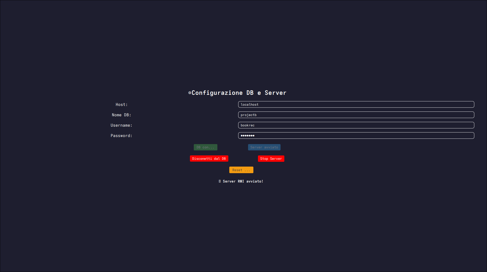

⚠️ **NON chiudere questo terminale! Il server deve restare in esecuzione.**

3. **FASE 3: Avviare l’Applicazione Client**
   - **Apri un NUOVO terminale nella cartella** principale:
     - `cd src/clientBR/`
     - `mvn javafx:run`

**Vedrai:** 1. Splash screen con video 2. Progress bar di caricamento 3. Schermata di login

4. **In alternativa:**
- E' possibile avviare il programma tramite un comodo script universale, windows linux o mac, tramite l'apposito comando:
  -  `cd bin`
  -  `bash ./launch-universal.sh` 

L'interfaccia consentirà di testare il proprio ambiente per verificarne la corretta compatibilità e poi darà la possibilità all'utente di avviare separatamente server e client. 

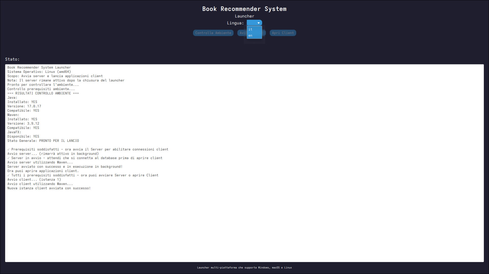

⚠️ **Ricordiamo che il programma e principalmente supportato e testato su piattaforme Linux quindi ci potrebbero essere problemi grafici in base al proprio sistema operativo** 

### Primo avvio

Se tutto è configurato correttamente:
- ✅ Server RMI avviato con successo
- ✅ Database creato correttamente
- ✅ Client GUI caricato
- ✅ Schermata di login visibile

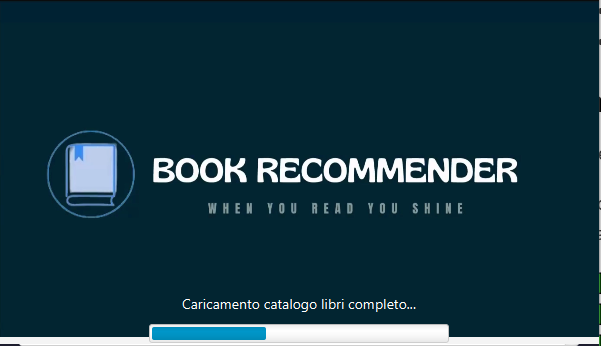

Quando avvierai l'applicazione, vedrai uno **splash screen** mentre il tuo sistema:

- ✅ Carica il catalogo dei libri
- ✅ Prepara l'ambiente
- ✅ Precarica le immagini dell'applicazione
- ✅ Inizializza l'interfaccia grafica

Questo tipicamente richiede **15-30 secondi** in dipendenza alla velocità della tua rete 

---

## Accesso e autenticazione

### Accesso

1. Accedi con il tuo **username** o **email** nel campo dell'accesso
2. Inserisci la tua **password**
3. Clicca **"Accesso"**

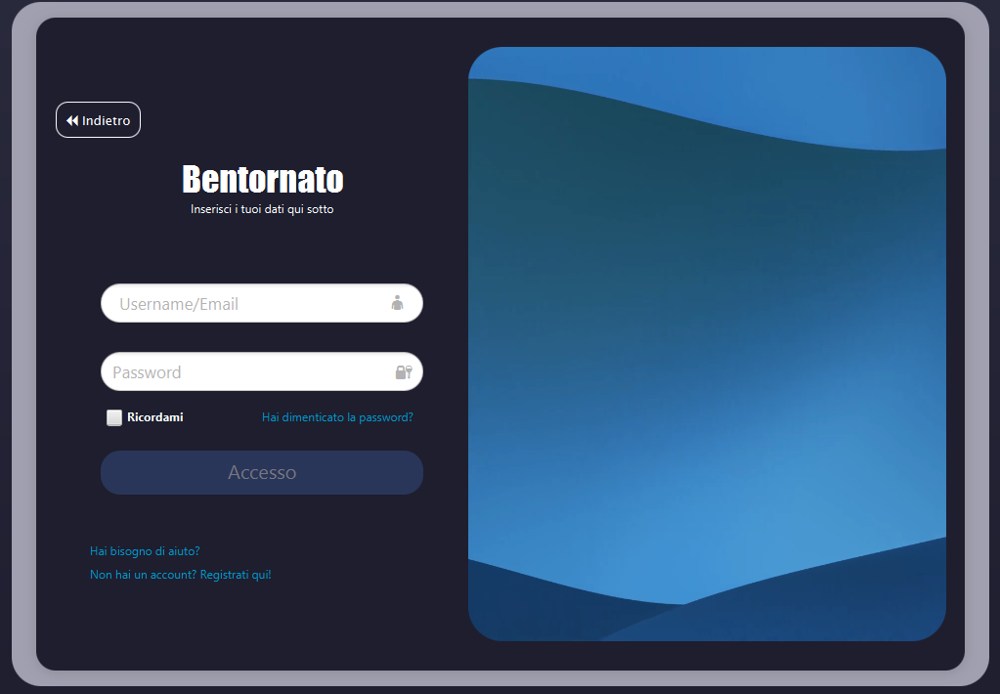

### Ricordami

Spunta la casella **"Ricordami"** per rimanere connesso anche chiusa l'applicazione ma senza fermare il server

### Hai dimenticato la password?

Se hai dimenticato la password:

1. Clicca **"hai dimenticato la password?"**
2. Inserisci **la tua email**
3. Verifica con **la frase di recupero**
4. Crea una **nuova password**

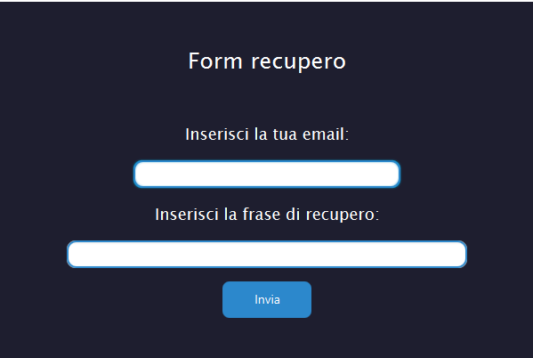

Se è necessario tornare alla schermata principale, si può usufruire del pulsante "**Indietro**"

## Registrazione utente

### Crea il tuo account

1. Nella schermata di login, click **"Crea Account"**
2. Riempi con le tue informazioni:

   

    | Campi richiesti   | Descrizione                         | Requisiti                                                          |
    | ----------------- | ----------------------------------- | --------------------------------------------------------------------- |
   | ID utente         | Il tuo univoco username             | 5+ caratteri e almeno 1 lettera                                       |
   | Nome              | Il tuo nome                         | Massimo 30 caratteri, no numeri                                       |
   | Cognome           | Il tuo cognome                      | Massimo 30 caratteri, no numeri                                       |
   | Email             | Il tuo indirizzo email              | Formato valido default email , massimo 320 caratteri                  |
   | Codice Fiscale    | In base alla struttura alfanumerica | Esattamente 16 caratteri maiuscoli alfanumerici                       |
   | Password          | La tua password sicura              | 8+ caratteri, mix di maiuscole/minuscole, numeri e caratteri speciali |
   | Frase di recupero | Per il recupero della password      | Qualsiasi password che tu ti possa ricordare                          |

3. Clicca **"Registrati"** per creare l'account, altrimenti premi **"Annulla" o "Hai già un account? Accedi da qui!"**, per tornare alla schermata di login. 

### Requisiti della password

La tua password deve includere almeno:
- ✅ **8 caratteri**
- ✅ **una lettera maiuscola** (A-Z)
- ✅ **una lettera minuscola** (a-z)
- ✅ **un numero** (0-9)
- ✅ **un carattere speciale**: `! @ # $ % ^ & * ( ) _ - + = < > ? [ ] { } | ; : , .`

**Esempio**: `MioLibro!2024`

### Verifica

Dopo la registrazione verrai indirizzato alla schermata di login, il tuo account in questo modo è **immediatamente attivo**. Potrai accedere subito al tuo nuovo account!

---

## Schermata Principale

### Interfaccia principale prima dell'accesso
La **pagina principale** sarà comune sia dopo ma con alcune limitazioni:

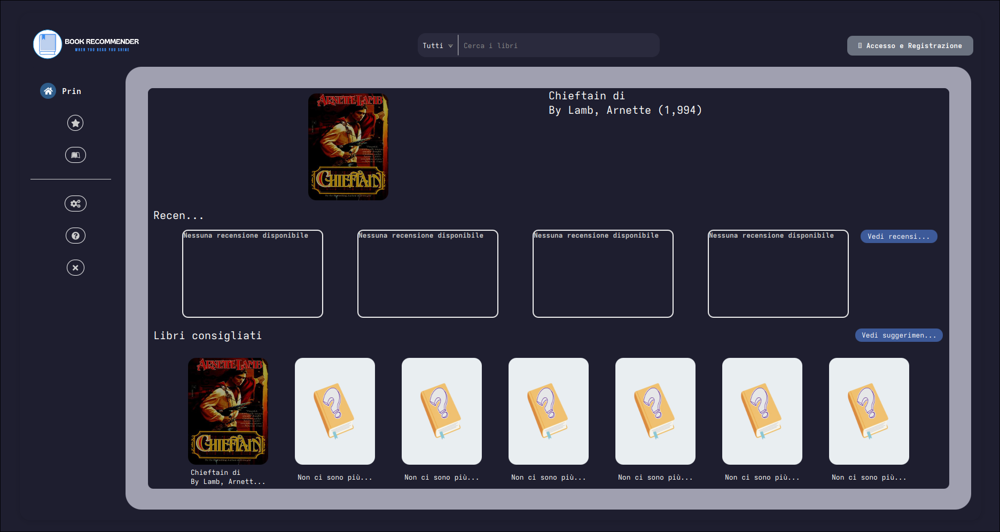

### Menu di Navigazione

| Sezione             | Icona | Descrizione                           |
| ------------------- | ---- | ------------------------------------- |
| **Principale**      | 🏠    | Vedrai i libri consigliati, recensioni e quelli cercati nella barra di ricerca |
| **Categorie**      | 📚    | Vengono mostrati tutti i libri in base alla categoria
| **Librerie**    | 📖    | Gestisci le tue librerie personali        |
| **Impostazioni**         | ⚙️    | Configura preferenze e account           |
| **Aiuto**            | ❓    | FAQ, video, documentazioni e supporto               |
| **Esci**            | X    | Uscita dall'applicazione               |

Non sarà possibile accedere al menu prima dell'accesso a:
- **Librerie**
- **Impostazioni: Cambia password e Profilo**

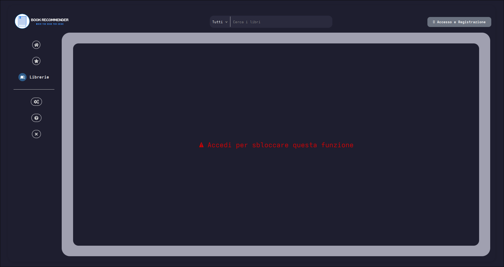

---

## Cerca libri

### Funzione di ricerca

Usa la **barra di ricerca** al centro dello schermo per cercare i libri:

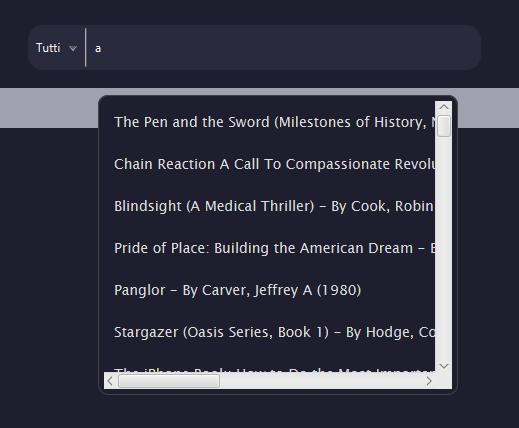

**Consigli di ricerca**
- Seleziona **Tutti**, **Titolo**, **Autori**, o **Autori e Anno**
- I risultati si aggiorneranno in base **subito** alla scelta selezionata
- Le ricerche saranno visualizzate come una lista il quale potrà essere premuto il libro e si vedrà sulla schermata **Principale**, in primo piano

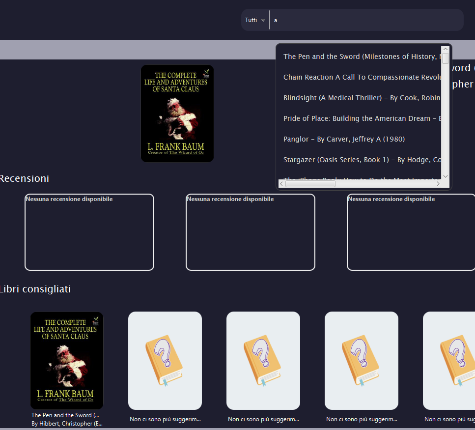

### Filtri per ricerca:

Considerando la scelta del filtro si potranno cercare: 

| Filtri            | Opzioni                                      |
| ----------------- | -------------------------------------------- |
| **Titolo**        | Fiction, Non-Fiction, Science, History, etc. |
| **Autore**        | "Stephen king", "Thomas Mann"                |
| **Autore e anno** | "Stephen king 1998", "Thomas Mann 2019"      |
| **Rating**        | 4+ stars, 3+ stars, All                      |

### Dettagli libro

Cliccando il libro in primo piano si potranno vedere i dettagli delle informazioni:

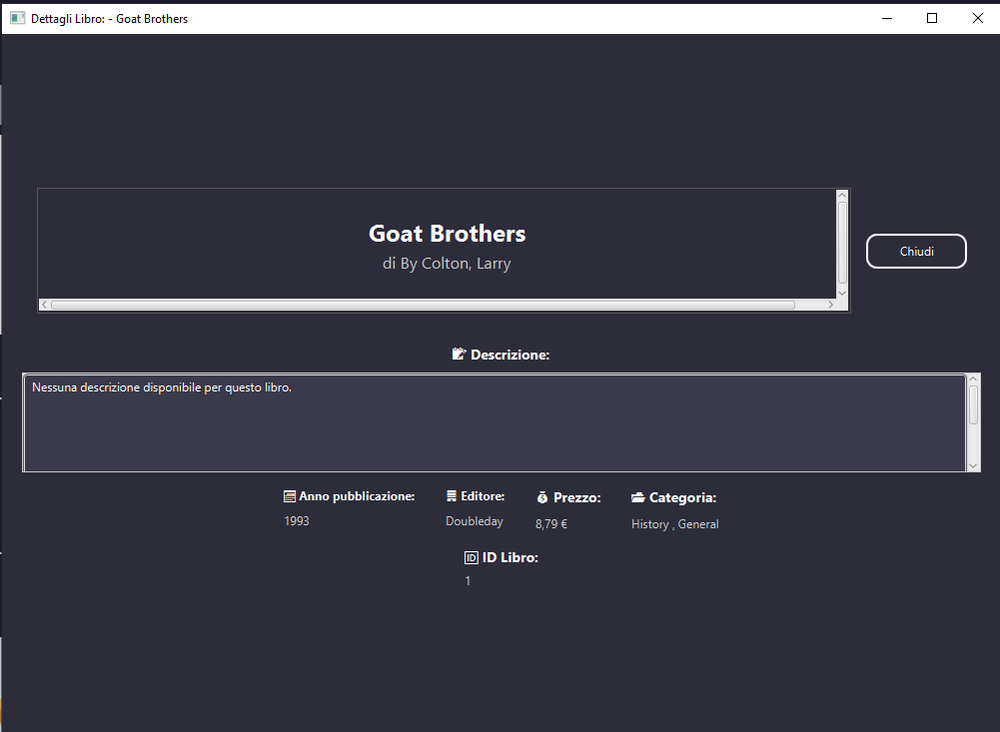

**Informazioni mostrate:**
- 📖 **Titolo** e **Autori**
- 📅 **Anno di pubblicazione**
- 🏷️ **Categoria** e **Editore**
- 💰 **Prezzo**
- 📝 **Descrizione**
- 📝**ID del libro**
- ⭐ **Valutazioni utenti e consigli** se presenti

⚠️ **Non si garantiscono tutti i dati presenti all'interno delle informazioni di ogni libro.**

## Categorie

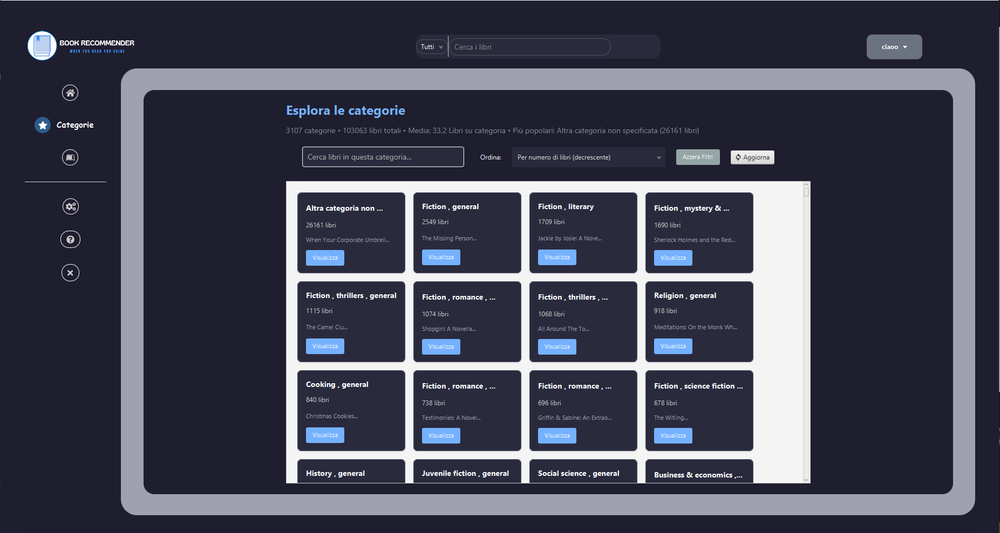

**In questa sezione si potranno vedere tutte le categorie dei libri e inoltre visualizzare all'interno i dettagli per ogni libro tramite il pulsante "Visualizza"**

### Interfaccia principale dopo l'accesso

### Azioni di un libro

| Azione                       | Descrizione                                    |
| ---------------------------- | ---------------------------------------------- |
| **Aggiungere alla libreria** | Salvare il libro in una tua libreria personale |
| **Scrivere una recensione**  | Valuta un libro in base a criteri specifici    |
| **Consigliare altri libri**  | Vedere libri consigliati per ogni libro        |

---

## Gestione librerie

### Crea una libreria

Organizza i tuoi libri all'interno delle tue **librerie personali** (come delle collezioni):

1. Vai sulla sezione: **Librerie**
   
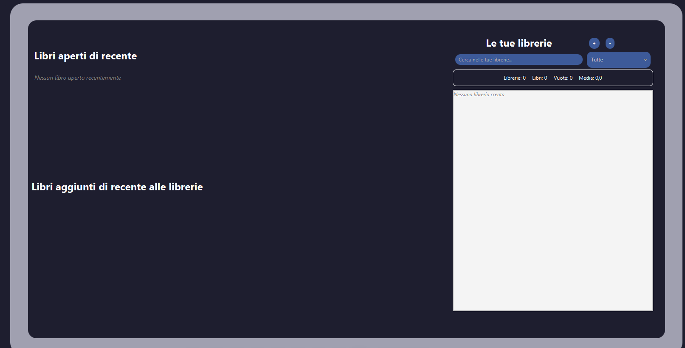

1. Clicca il pulsante **"+"**
2. Inserisci un **nome** per la tua libreria, diverso dagli altri
3. **Seleziona i libri** desiderati

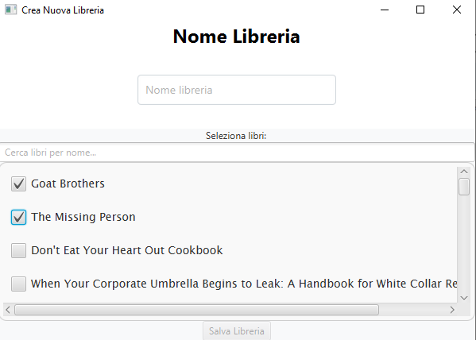

4. Clicca **"Salva libreria"**

**Esempi:**
- 📚 "Letture accademiche"
- 🎓 "Libri preferiti"
- 🌍 "Libri di viaggio"

**non è possibile inserire lo stesso libro in due librerie diverse!**

### Visualizza le tue librerie

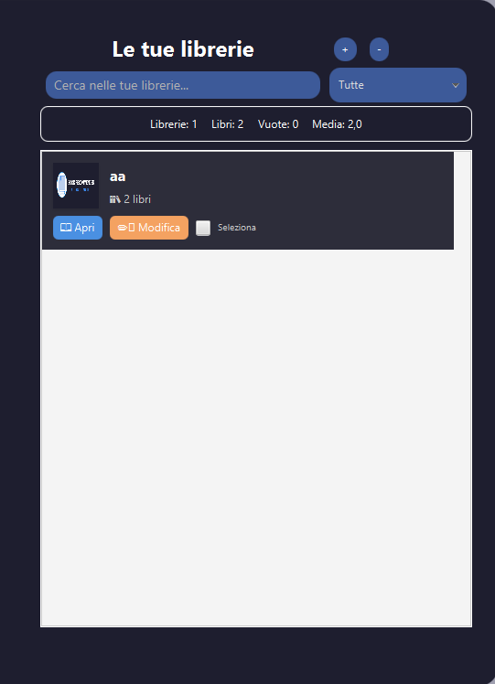

Ogni libreria mostra:
- 📊 **Da quanti libri è formato**
- 📅 **Se sono vuote**
- 📈 **La media di libri per librerie**

### Modifica una libreria

1. Seleziona la libreria
2. Premi **"Modifica libreria"**
3. Cambia i **libri associati**
4. Premi **"Salva"**

### Cancellare una libreria

⚠️ **Avviso:** Cancellare una libreria ne comporta anche la rimozione dei libri al suo interno(però sarà possibile aggiungerlo ad altre librerie).

1. Premi sulla libreria **Seleziona**
2. Premi **"-"**
3. **Conferma la cancellazione**

---

## Recensioni

### Recensire un libro

Condividi la tua esperienza con la community:

1. Apri il dettaglio della tua libreria con il pulsante **"Apri"**
2. Clicca **"Recensione"**

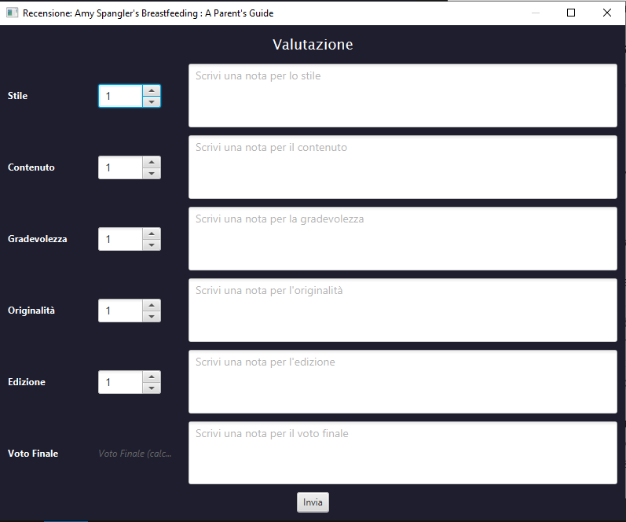

3. Recensisci il libro in base a **5 criteri** (1-5 stelle):
   - 🎨 **Stile**: Qualità della scrittura e leggibilità
   - 📖 **Contenuto**: Profondità e rilevanza del contenuto
   - 😊 **Gradevolezza**: Fattore di divertimento
   - 📚 **Utilità**: Valore pratico e utilità
   - 🏆 **Edizione**: Qualità della stampa/edizione

4. Aggiungi **note opzionali** per ogni categoria (massimo 256 caratteri)
5. Aggiungi **un commento finale** (massimo 256 caratteri)
6. Premi **"Invia"** per salvare la recensione

### Modifica una recensione

1. Vai sulla tua libreria
2. Apri il tuo libro già recensito
3. Apparirà il form precompilato, fai le tue modifica
4. Premi **"Salva"**, la tua recensione verrà aggiornata

### Elimina il libro dalla libreria

1. Vai sulla tua libreria
2. Trova il libro
3. Clicca **"Rimuovi"**
4. **Conferma l'eliminazione**

---

## Consigli personalizzati

### Come funziona

Il motore di raccomandazione analizza:
- 📚 **La tua cronologia di lettura**
- ⭐ **Le tue valutazioni dei libri**
- 📖 **I libri nelle tue librerie**

### Visualizzare i Consigli

1. Vai alla sezione **Suggerisci**
2. Seleziona **massimo** 3 libri di suggerimento

   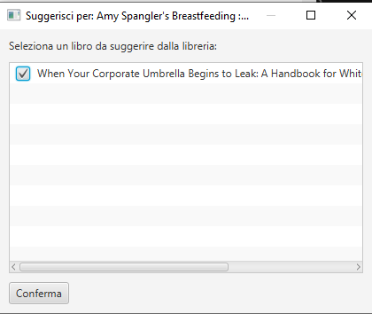

### Migliorare i Consigli

Per ottenere suggerimenti migliori:
- ✅ **Valuta più libri** (più valutazioni, migliori consigli)
- ✅ **Crea librerie dettagliate** con i tuoi interessi
- ✅ **Leggi i libri consigliati**
---

## Impostazioni e aspetto

Premi sull'icona **⚙️ Impostazioni** nel menu di navigazione, saranno presenti:

### Aspetto

L'applicazione supporta **linguaggi multipli**:

| Lingua | Codice |
| -------- | ---- |
| Inglese  | en   |
| Italiano | it   |

Per cambiare lingua:
1. Vai in **Impostazioni**
2. Vedrai **Lingua**
3. **SOLO AVVIANDO IL** **launcher** iniziale potrai cambiare la lingua di avvio dell'applicazione

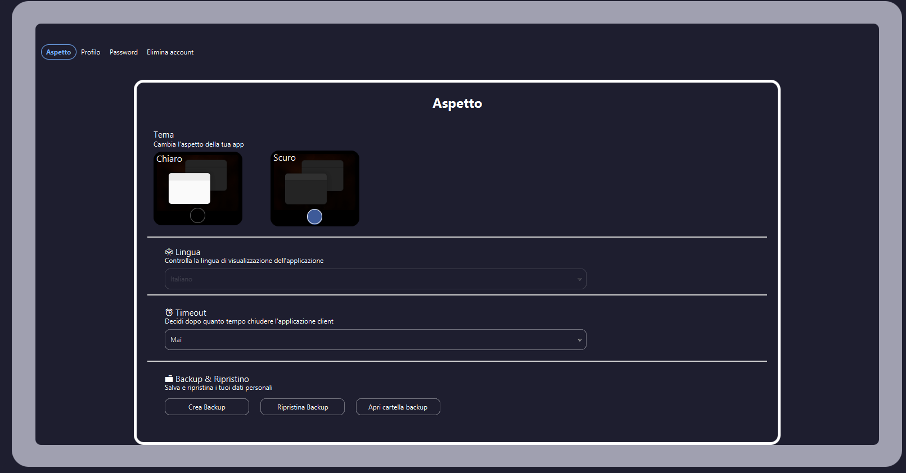

Personalizza l'aspetto dell'applicazione

| Tema      | Descrizione                                       |
| ---------- | ------------------------------------------------- |
| **Chiaro** | Tema chiaro di default con sfondo bianco          |
| **Scuro**  | Tema scuro per ambienti a bassa intensità di luce |

Per cambiare tema:
1. Premi **Impostazioni, Aspetto**
2. Seleziona il **Tema preferito**
3. L'app si aggiornerà immediatamente

| Impostazione         | Opzioni                                                                                    |
| --------------- | ------------------------------------------------------------------------------------------ |
| **Disconnessione automatica** | 15 minuti, 30 minuti, 1 ora, Mai                              |
| **Backup**      | All'accesso apparirà una schermata per salvare il proprio backup dell'applicazione attuale |

**Consiglio di sicurezza:** Usa basso timeout se si è in un ambiente pubblico o condiviso.

### Impostazioni account

#### **Informazione del profilo**
- Modifica il tuo **nome**, **cognome**
- Modifica la tua **foto profilo**

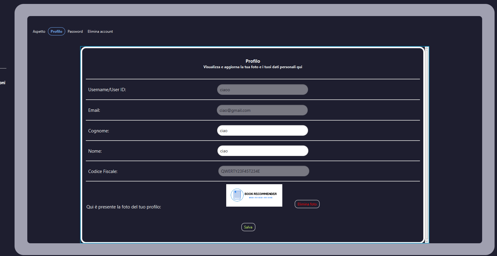

#### **Password**
- Cambia la tua **password attuale**
- Imposta una **nuova password** e verificala

**Consiglio di sicurezza**: cambia la password regolarmente e usa una password unica per questo account.

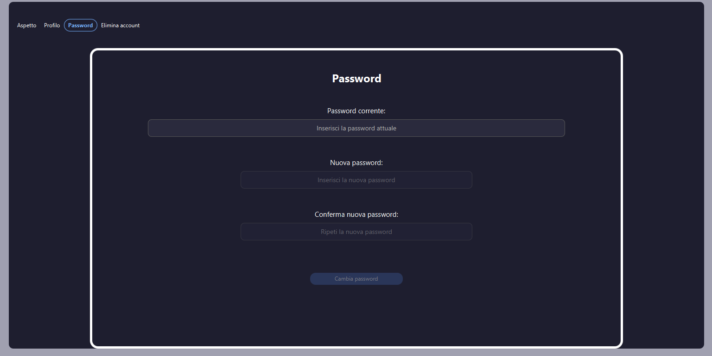

---

## Aiuto

### Domande Frequenti (FAQ)

#### Accedi alla sezione FAQ dal menu di **Aiuto**:

**Come posso resettare la mia password?**

**Come faccio a scaricare i manuali?**

**Come contattare l'assistenza?**

**Posso cambiare il tema dell'app?**

### Video Tutorial

Guarda dei video passo-passo:

| Argomento                         | Durata |
| ----------------------------- | -------- |
| Iniziare con l'app               | 5 min    |
| Gestire le librerie              | 8 min    |
| Scrivere recensioni              | 6 min    |
| Capire i consigli                | 7 min    |

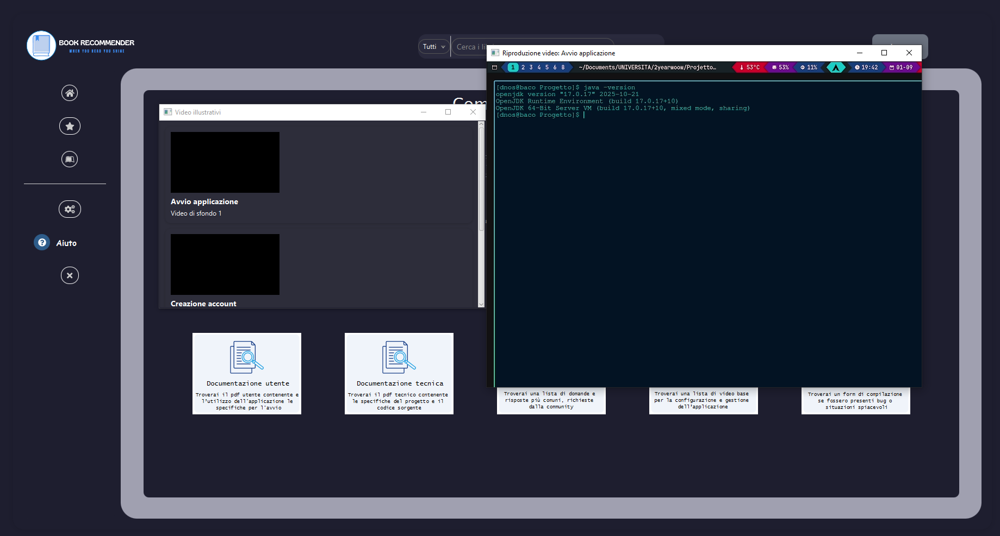

### Contatta il supporto

Se hai bisogno di ulteriore aiuto:

1. Vai in **Aiuto** → **Contatta supporto**
2. Riempi il form dedicato:
   - **Oggetto** della tua richiesta
   - **Descrizione** del problema
3. Premi **"Invia"**

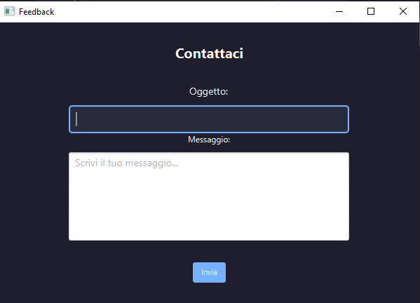

### Riguardo l'applicazione

**Versione:** 1.0-SNAPSHOT
**Data di rilascio:** Gennaio 2026
**Licenza:** Solo uso educativo

---

**Divertiti ad usare Book Recommender! 📚✨**

Per più informazioni o supporto, fare riferimento al link github o contatta il nostro team di supporto.

